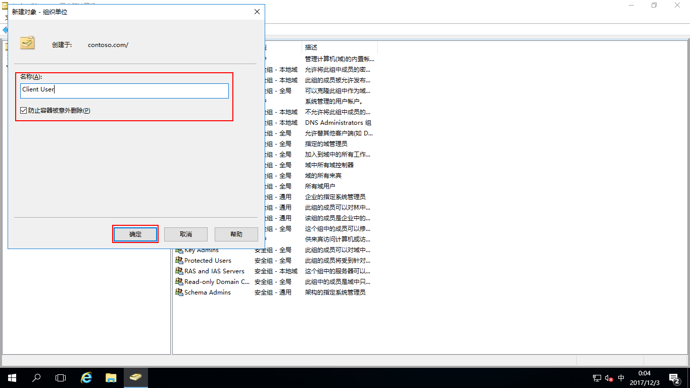

# Windows Server 2016 AD中新建组织单位、组、用户

## 主题
- [新建组织单位](#新建组织单位)
- [新建组](#新建组)
- [新建用户](#新建用户)
## 新建组织单位

组织单位简称OU，OU是（Organizational Unit）的缩写，组织单位是可以将用户、组、计算机和组织单位放入其中的容器。是可以指派组策略设置或委派管理权限的最小作用域或单元。

点击“开始”-“Windows管理工具”-“Active Directory用户和计算机”，打开“Active Directory用户和计算机”，右击“contoso.com”域-“新建”-“组织单位”，也可以单击工具栏中的“新建组织单位”按钮进行新建组织单位

设置组织单位名称，把“防止容器被意外删除”打勾，点“确定”

这样组织单位就新建完成了

## 新建组

组称Group，组可以添加用户成员，也可以隶属于组

右击“Group”组织单位-“新建”-“组”，也可以单击工具栏中的“新建组”按钮进行新建组

设置组名，组作用域默认，也可以根据自己的需要更改，点击“确定”

这样组就新建完成了

## 新建用户

用户称User，是用于登录到域中计算机的帐户

右击“Client User”组织单位-“新建”-“用户”，也可以单击工具栏中的“新建用户”按钮进行新建用户

用户信息根据自己的需求填写，点击“下一步”

设置用户密码，点“下一步”

设置完成，点击“完成”

这样用户就新建完成了
