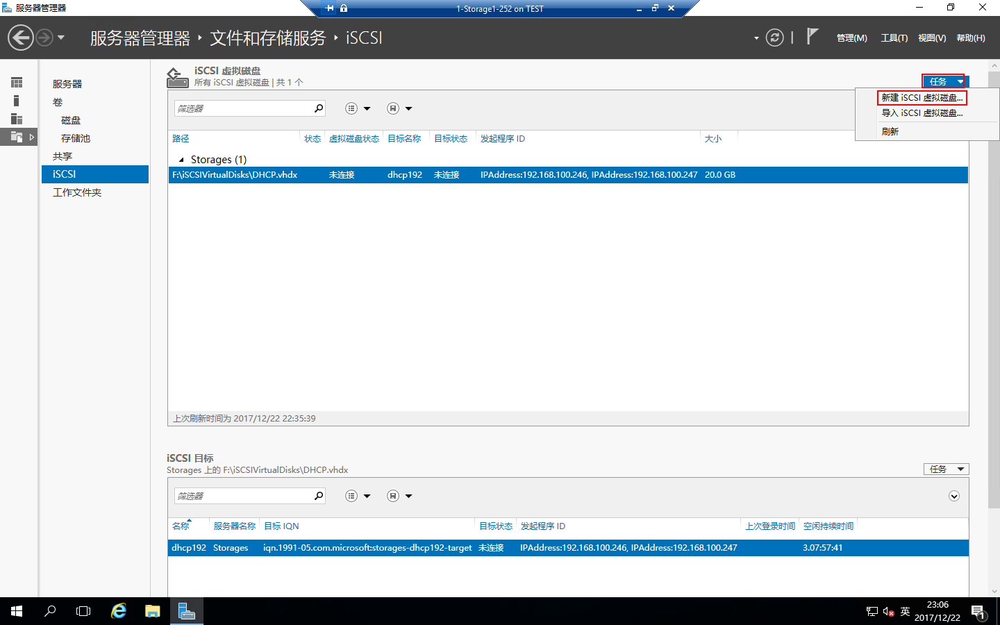
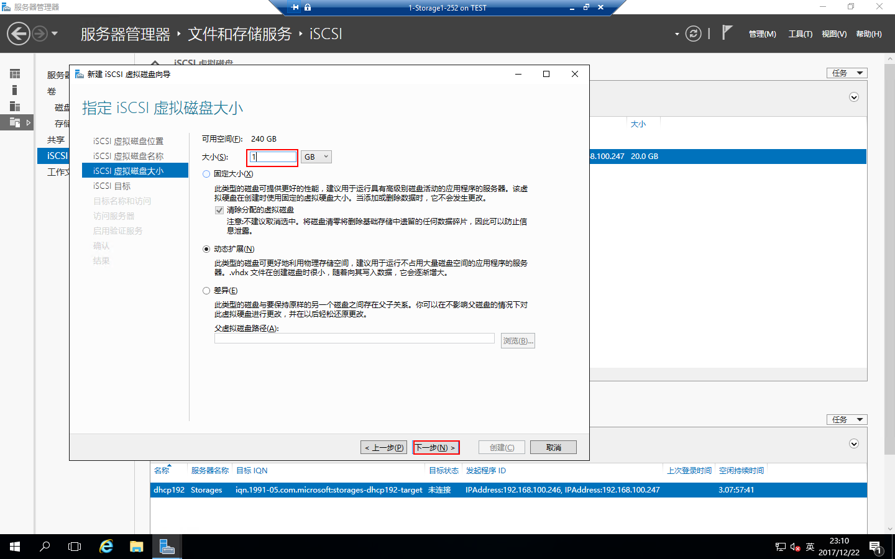
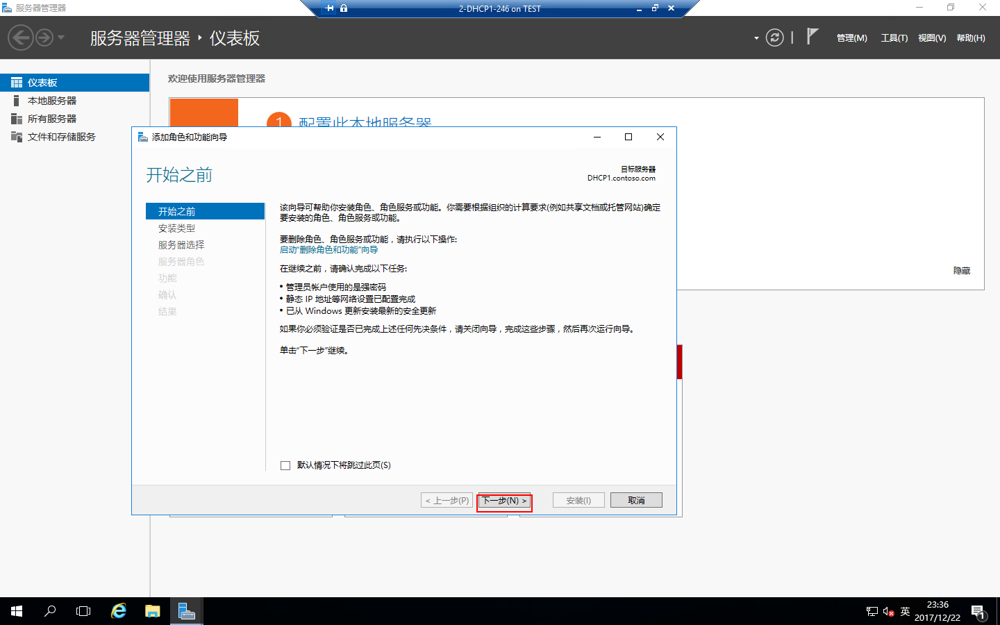
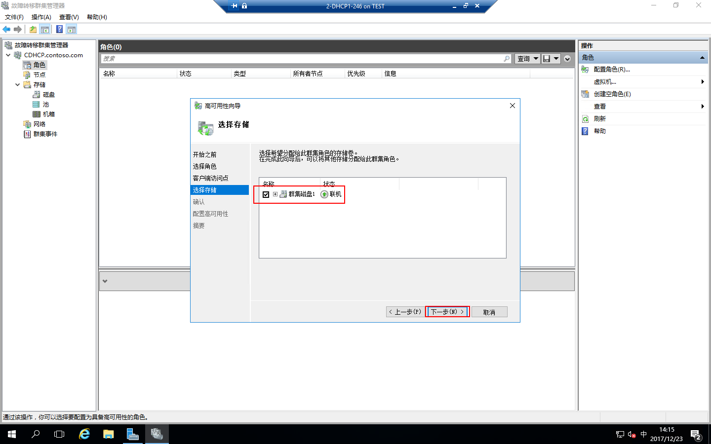

# Windows Server 2016部署DHCP Failover Cluster

本文主要介绍如何在Windows Server 2016中部署DHCP Failover Cluster；什么是Failover Cluster，请查看[微软技术文档](https://docs.microsoft.com/zh-cn/windows-server/failover-clustering/failover-clustering-overview)。

## 主题

- [部署环境](#部署环境)
- [先决条件设置](#先决条件设置)
- [配置存储](#配置存储)
- [角色安装](#角色安装)
- [连接存储配置磁盘](#连接存储配置磁盘)
- [配置故障转移群集](#配置故障转移群集)
- [配置作用域](#配置作用域)
- [验证](#验证)

## 部署环境

| 编号 | 服务器名称 | IP地址 | 操作系统 |
| :---: | :-----:| :----: | :--- |
| 001 | AD1 | 192.168.100.250 | Windows Server 2016 Datacenter Evaluation |
| 002 | Storage | 192.168.100.252| Windows Server 2016 Datacenter Evaluation |
| 003 | DHCP1 | 192.168.100.246| Windows Server 2016 Datacenter Evaluation |
| 004 | DHCP2 | 192.168.100.247| Windows Server 2016 Datacenter Evaluation |
| 005 | CDHCP | 192.168.100.248 |  DHCP Cluster | / |
| 006 | DHCP | 192.168.100.249 |  DHCP Service | / |

## 先决条件设置

1、配置AD域控制器，如何配置AD域控制器请查看[创建AD域](./../../DOCS/AD/AD-Deployment.md)  
2、部署Storage，如何配置存储请查看[部署Storage](./../../DOCS/Storage/Storage-ISCSI-Configuration.md)  
3、设置IP地址，DNS指向域控制器IP  

DHCP1：  
IP Address：192.168.100.246   
Netmask：255.255.255.0  
Gateway：192.168.100.1  
DNS：192.168.100.250   

DHCP2：  
IP：192.168.100.247  
Netmask：255.255.255.0    
Gateway：192.168.100.1  
DNS：192.168.100.250

4、设置计算机名，加入contoso.com域

## 配置存储

存储需要配置两个ISCSI虚拟磁盘，一个存储盘设置20GB，一个仲裁盘1GB  
先配置一个存储盘，在Storage服务器上打开“服务器管理器”，点击“文件和存储服务”

进入“服务器管理器”-“文件和存储服务”-“ISCSI”

点击“任务”-“新建ISCSI虚拟磁盘”

运行“新建ISCSI虚拟磁盘向导”，选择“ISCSI虚拟磁盘位置”，点击“下一步”

设置“ISCSI虚拟磁盘名称”，点击“下一步”

设置“ISCSI虚拟磁盘大小”，我们这里设置20GB，点击“下一步”

ISCSI目标选择“新建ISCSI目标”，点击“下一步”

设置目标名称，点击“下一步”

设置访问服务器，点“添加”，选择用于标识发起程序的方式，选择“输入选定类型的值”，类型选择“IP地址”，值设置为“192.168.100.246”，点击“确定”

再添加一个IP地址类型的值为“192.168.100.247”

访问服务器添加好了，点击“下一步”

启用验证服务这里直接“下一步”

确认配置，点击“创建”

配置完成，点击“关闭”

这时可以在“ISCSI虚拟磁盘”中看到刚才建立的ISCSI虚拟磁盘

还需要配置一个仲裁盘，依然在ISCSI界面中点“任务”-“新建ISCSI虚拟磁盘”

运行“新建ISCSI虚拟磁盘向导”，选择ISCSI虚拟磁盘位置，点击“下一步”

设置“ISCSI虚拟磁盘名称”，点击“下一步”

设置“ISCSI虚拟磁盘大小”，这里设置为1GB，仲裁盘不需要太大，点击“下一步”

设置“ISCSI目标”，已经设置过了，选择“现有ISCSI目标”，点击“下一步”

确认配置，点击“创建”

配置完成，点击“关闭”

两个ISCSI虚拟磁盘都创建好了，现在去部署DHCP

## 角色安装

**角色安装**，DHCP1和DHCP2配置相同  
在DHCP1中打开“服务器管理器”，点击“添加角色和功能

运行“添加角色和功能向导”，点击“下一步”

安装类型选择“基于角色或基于功能的安装”，点击“下一步”

服务器选择，点击“下一步”

服务器角色选择“DHCP服务器”，提示“添加DHCP服务器所需的功能”，点击“添加功能”

“DHCP服务器”选中后，点击“下一步”

功能选择“故障转移群集”，提示“添加故障转移群集所需的功能？”，点击“添加功能”

故障转移群集功能选中后，点击“下一步”

点击“下一步”

确认配置，点击“安装”

角色和功能都已经安装完成，点击“关闭”，然后将服务器重新启动一下

重启之后还是登录DHCP1服务器，打开“服务器管理器”，点“通知”-“完成DHCP配置”

运行“DHCP安装后配置向导”，点击“下一步”

授权方式选择“使用以下用户凭据”，我这里是用域管理员登录的，当然你也可以创建一个有域管理员权限的帐户登录，点击“提交”

配置完成，点击“关闭”

## 连接存储配置磁盘

**连接存储配置磁盘**，DHCP1和DHCP2配置相同  
**连接存储**  
在DHCP1打开“服务器管理器”，点击“工具”-“ISCSI发起程序”

这时会提示：“Microsoft ISCSI 服务尚未运行，若要使ISCSI正常工作，必须启动该服务...”，点击“是”

弹出“ISCSI发起程序属性”，在目标中目标栏填写存储的IP地址，点击“快速连接”

弹出“快速连接”对话框，点“完成”

在“ISCSI发起程序属性”中，点击“确定”

**配置磁盘**  
在DHCP1上右击“开始”-“磁盘管理”

这时可以看到已经连接到的两块硬盘

右击“磁盘1”-“联机”

右击“磁盘2”-“联机”

右击“磁盘1”-“初始化磁盘”

这时可以选择“磁盘1”和“磁盘2”一起初始化，点击“确定”

这时可以看到两块已经初始化过的磁盘

右击“磁盘1”-“新建简单卷”

运行“新建简单卷向导”，点击“下一步”

指定卷大小，点击“下一步”

分配卷的驱动器为E盘，点击“下一步”

配置格式化分区，点击“下一步”

新建简单卷完成，点击“完成”

磁盘2和磁盘1一样，需要新建简单卷，右击“磁盘2”-“新建简单卷”

运行“新建简单卷向导”，点击“下一步”

指定卷大小，点击“下一步”

给卷指定驱动器，点击“下一步”

配置格式化分区，点击“下一步”

新建简单卷完成，点击“完成”

这时磁盘就配置完成了

我的电脑里面也出现了磁盘E和磁盘F

## 配置故障转移群集
故障转移群集只需要在一台DHCP上配置就可以了，打开DHCP1的“服务器管理器”-“工具”-“故障转移群集”

打开“故障转移群集管理器”，点击“验证配置”

运行“验证配置向导”，点击“下一步”

选择服务器，点击“浏览”，将“输入对象名称中”输入“DHCP”，点“检查名称”，选中“DHCP1”和“DHCP2”，点击两次“确定”

服务器选择好了，点击“下一步”

测试选项“运行所有测试”，点击“下一步”

确认配置，点击“下一步”

验证完成，点击“完成”

依然在“故障转移群集管理器”上，点击“创建群集”

运行“创建群集向导”，点击“下一步”

选择服务器，点击“浏览”，将“输入对象名称”中输入“DHCP”，点“检查名称”，选中“DHCP1”和“DHCP2”，点击两次“确定”

服务器选择好了，点击“下一步”

配置群集名称和IP地址，点击“下一步”

确认配置，点击“下一步”

创建群集配置完成，点击“完成”

展开群集，点击“节点”可以看到“DHCP1”和“DHCP2”两个节点

点击磁盘，可以看到“群集磁盘1”和“群集磁盘2”，而且“群集磁盘2”自动设置成了“仲裁中的磁盘见证”

点角色，点击“配置角色”

运行“高可用性向导”，点击“下一步”

选择角色，这里选择“DHCP服务器”，点击“下一步”

配置客户端访问点的名称和IP地址，点击“下一步”

选择存储，这里选择“群集磁盘1”，点击“下一步”

确认配置，点击“下一步”

配置完成，点击“完成”

这时可以看到角色里面的DHCP正在运行，所有者节点为DHCP1上

## 配置作用域

> 注：DHCP服务器运行在哪个节点，就在那台服务器上配置DHCP，则列一台暂为无法配置状态。  
现在在群集上可以看到DHCP运行的节点为DHCP1上

在DHCP1上打开“服务器管理器”点击“工具”-“DHCP”

打开“DHCP管理器”，展开DHCP，右击“IPv4”-“新建作用域”

运行“新建作用域向导”，配置作用域名称，点击“下一步”

配置作用域的IP地址范围，点击“下一步”

配置排除的地址范围，点击“下一步”

配置地址的租用期限，点击“下一步”

配置DHCP选项，点击“下一步”

配置网关，点击“下一步”

配置域名称和DNS服务器，点击“下一步”

配置WINS服务器，点击“下一步”

配置激活作用域，点击“下一步”

作用域配置完成，点击“完成”

这时作用域已经配置完成了，已经有一台计算机获取到了IP地址

## 验证
这时重新找一台计算机，将IP地址设置为自动获取，如下可以看到IPv4 DHCP服务器是192.168.100.249，验证成功

