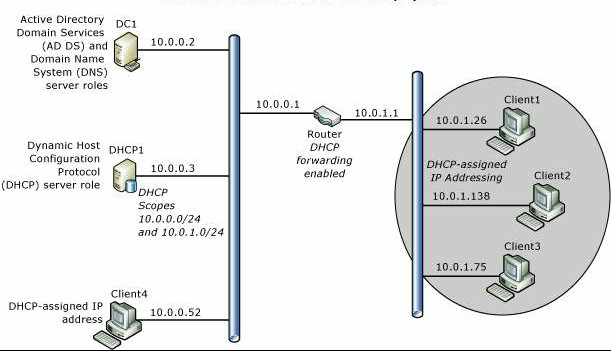

# Windows Server 2016部署DHCP

[DHCP](https://docs.microsoft.com/zh-cn/windows-server/networking/technologies/dhcp/dhcp-top)是Dynamic Host Configuration Protocol的缩写，中文称动态主机配置协议；通常被用于大型网络环境中，主要作用是集中管理、分配IP地址；在局域网中的主机可以动态的获取IP地址、Gateway地址和DNS服务器地址等信息，并能够提升使用率。更多DHCP概述请查看[微软技术文档](https://docs.microsoft.com/zh-cn/windows-server/networking/technologies/dhcp/dhcp-top)。本文详细介绍部署步骤。

## 主题

- [部署环境](#部署环境)
- [部署概述](#部署概述)
- [先决条件设置](#先决条件设置)
- [角色安装](#角色安装)
- [配置服务器](#配置服务器)
- [配置作用域](#配置作用域)

## 部署环境
| 编号 | 服务器名称 | IP地址 | 操作系统 |
| :---: | :-----:| :----: | :--- |
| 001 | AD1 | 192.168.100.250 | Windows Server 2016 Datacenter Evaluation |
| 002 | DHCP | 192.168.100.252| Windows Server 2016 Datacenter Evaluation |

## 部署概述

## 先决条件设置

1、部署AD域控制器，见[AD域控制器部署部分](./../../DOCS/AD/AD-Deployment.md) \
2、将DHCP服务器的IP地址设置成手动指定，DNS指向AD域服务器IP \

3、将DHCP服务器加入域中（加域完成后重启服务器）

## 角色安装

在需要部署DHCP的服务器中打开“服务器管理器”，点击“添加角色和功能”

运行“添加角色和功能向导”，点击“下一步”

安装类型选择“基于角色或基于功能的安装”，点击“下一步”

服务器选择“从服务器池中选择服务器”，选中本地服务器的计算机名称，点击“下一步”

服务器角色选择“DHCP服务器”，弹出“添加DHCP服务器所需的功能？”，点击“添加功能”

“DHCP服务器”选择后，点击“下一步”

点击“下一步”

点击“下一步”

把“如果需要，自动重新启动目标服务器”打勾，点击“安装”

正在安装DHCP服务器角色

安装完成，点击“关闭”

## 配置服务器

打开“服务器管理器”，点击“通知”-“完成DHCP配置”

运行“DHCP安装后配置向导”，点击“下一步”

授权选择“使用以下用户凭据”，点击“提交” \
解释： \
使用以下用户凭据：就是使用现在登录的这个用户来授权 \
使用备用凭据：可以点击“指定”在AD域中指定用户来授权 \
跳过AD授权：没有AD域的情况下使用

配置完成，点击“关闭”

## 配置作用域
打开“服务器管理器”，点击“工具”-“DHCP”，也可以点击“开始”-“Windows 管理工具”-“DHCP”

先展开DHCP，右击HDCP管理器中的“IPv4”-“新建作用域”

运行“新建作用域向导”，点击“下一步”

配置作用域名称及描述，点击“下一步”

配置作用域的起止IP和长度，点击“下一步”

配置作用域需要排除的IP及延迟，将排除的起止IP输入到起始IP地址和结束IP地址处，点“添加”，再点击“下一步” \
解释： \
作用域IP范围：192.168.100.1-192.168.100.254 \
作用域IP排除范围：192.168.100.1-192.168.100.100和192.168.100.200-192.168.100.254

配置作用域IP的租用期限，我们设置租用为8天，点击“下一步”

配置DHCP选项 \
是否要立即为此作用域配置DHCP选项？（DHCP选项包括：网关，DNS，WINS等）
“是，我想现在配置这些选项。”
也可以选“否，我想稍后配置这些选项。”
点击“下一步”

配置作用域的路由器，也就是网关，将网关IP输入到IP地址处，点“添加”，再点“下一步”

配置作用域的域名和DNS服务器，因为是加入域中的服务器，所以这里已经自动配置好了，直接点击“下一步”

配置作用域WINS服务器，没有WINS服务器，直接点击“下一步”

是否要立即激活此作用域，选择“是，我想现在激活此作用域”，点击“下一步”

作用域配置完成，点击“完成”

展开DHCP，就可以看到我们刚才配置的作用域了,“地址池”中有“地址分发范围”和“分发中不包括的IP地址”

“作用域选项”中有“路由器，DNS服务器，DNS域名”，

地址租用中已经有一台主机获取到了一个IP地址，这样一个完整的作用域就配置完成了

