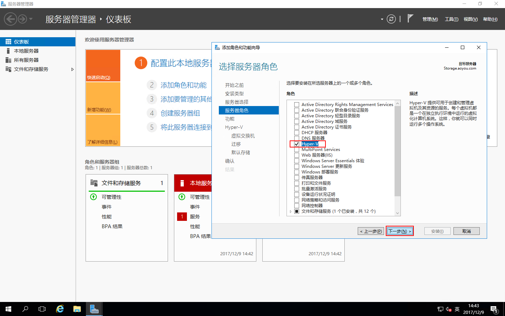
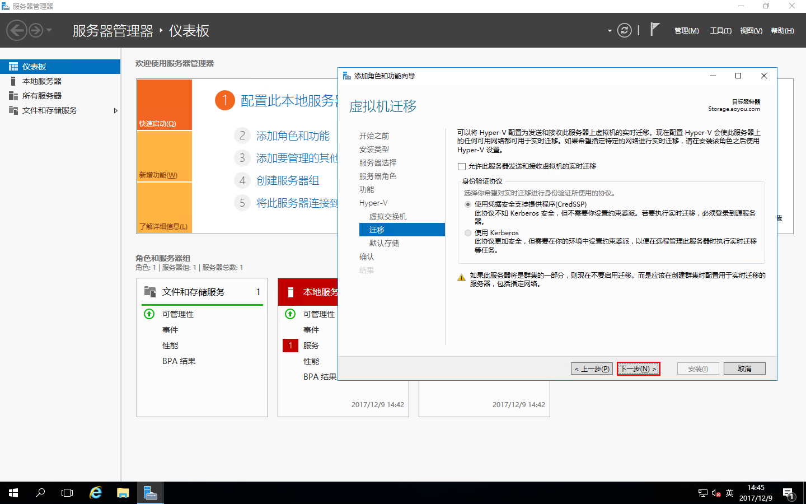
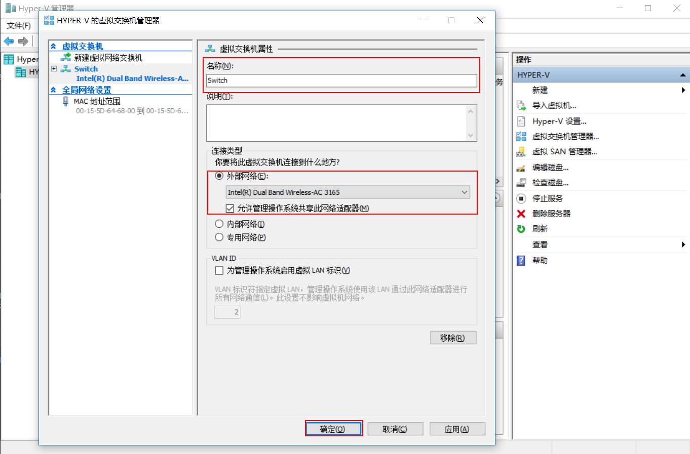

# Windows Server 2016 部署Hyper-V
[Hyper-V](https://docs.microsoft.com/zh-cn/windows-server/virtualization/hyper-v/hyper-v-on-windows-server)是微软的一款虚拟化产品。Hyper-V的概述请查看[微软技术文档](https://docs.microsoft.com/zh-cn/windows-server/virtualization/hyper-v/hyper-v-on-windows-server),以下详细介绍Hyper-V的部署。

## 主题：
- [部署环境](#部署环境)
- [角色安装](#角色安装)
- [配置虚拟机](#配置虚拟机)
- [配置虚拟交换机](#配置虚拟交换机)

## 部署环境
| 编号 | 服务器名称 | IP地址 | 操作系统 |
| :---: | :-----: | :------: | :-----|
| 001 | Hyper-V | 192.168.100.244 | Windows Server 2016 Datacenter Evaluation |

## 角色安装

在需要部署Hyper-V的服务器上打开“服务器管理器”，点击“添加角色和功能”，运行“添加角色和功能向导”，点击“下一步”

安装类型选择“基于角色或基于功能的安装”，点击“下一步”

服务器选择“从服务器池中选择服务器”，选中本地服务器的计算机名，点击“下一步”

服务器角色选择“Hyper-V”，弹出“添加Hyper-V所需的功能？”，点击“添加功能”

选中“Hyper-V”角色后，点击“下一步”

功能选择不用管，直接点击“下一步”

点击“下一步”

虚拟交换机不用管，我们后面创建，点击“下一步”

点击“下一步”

Hyper-V的默认存储位置，我们设置在D盘，设置好了，点击“下一步”

确认配置，把“如果需要，自动重新启动目标服务器”打勾，点击“安装”

正在安装，安装Hyper-V角色需要重新启动服务器，这里会自动重启服务器

Hyper-V角色安装完成，点击“关闭”

## 配置虚拟机
打开Hyper-V服务器的“服务器管理器”-“工具”-“Hyper-V管理器”，或者点“开始”-“Windows管理工具”-“Hyper-V管理器”

打开Hyper-V管理器

点击“Hyper-V设置”，打开“Hyper-V的Hyper-V设置” \

我们这里设置如下： \
虚拟硬盘：E:\Hyper-V\Virtual Hard Disks \
虚拟机：E:\Hyper-V\
物理GPU：NVIDIA GeForce 940MX \
其它的用的很少，这里就不多说了，设置好了，点击“确定”

## 配置虚拟交换机
点击“Hyper-V管理器”中的“虚拟交换机管理器”，打开“虚拟交换机管理器”

在虚拟交换机管理器中点击“新建虚拟网络交换机”，创建虚拟交换机类型选择“外部”，然后点击“创建虚拟交换机”

设置虚拟交换机名称为“Switch”，当然这里你可以随便设置，连接类型选择“外部网络”，点击“确定”

这是会提示“挂起的更改可能会中断网络连接”，点击“是”,这样虚拟交换机就创建完成了
