## Windows Server 2016 Hyper-V 虚拟机导出和导入

## 主题
- [虚拟机导出](#虚拟机导出)
- [虚拟机导入](#虚拟机导入)

## 虚拟机导出

点“开始”-“Windows管理工具”-“Hyper-V管理器”，打开“Hyper-V管理器”，或者打开“服务器管理器”-“工具”-“Hyper-V管理器”，打开“Hyper-V管理器”
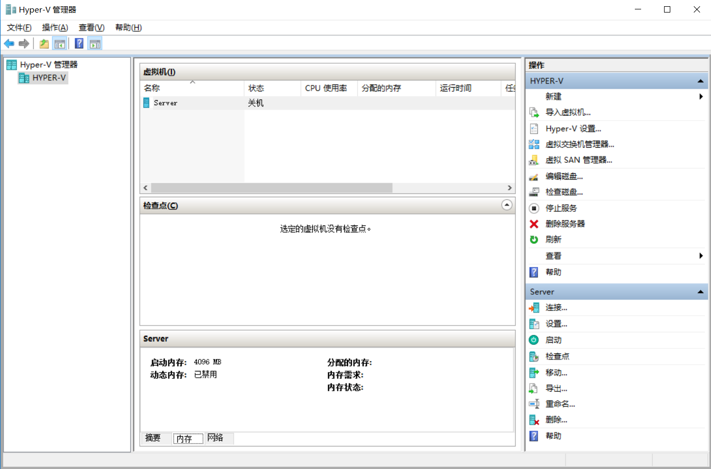
我们打开“Hyper-V管理器”后，看到已经创建了一台虚拟机，选中虚拟机，右击虚拟机选择“导出”
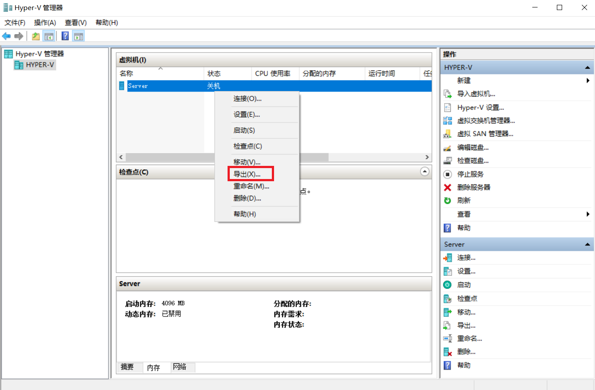
指定导出的位置，我们把位置指定在E:\Hyper-V\template的文件夹中，点“导出”
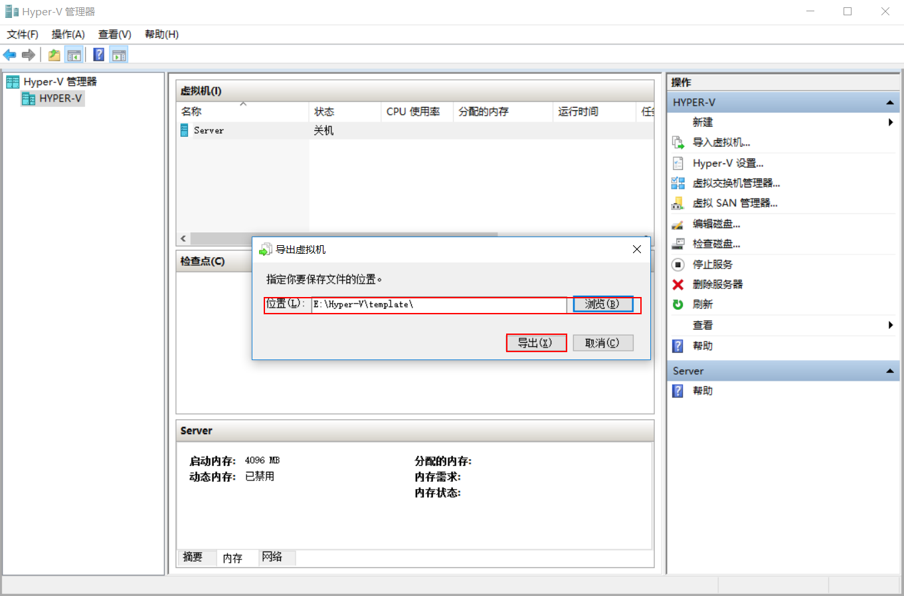
打开导出的文件目录，可以看到导出的Server文件夹，就是我们刚才导出的，导出虚拟机完成
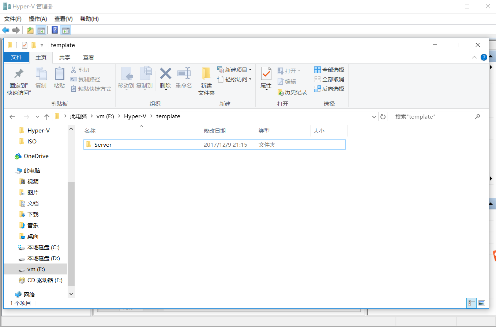

## 虚拟机导入
我们依然回到“Hyper-V管理器”，里面已经有一台Server虚拟机，我们把它重命名为Server1，然后进行导入，点击“导入虚拟机”
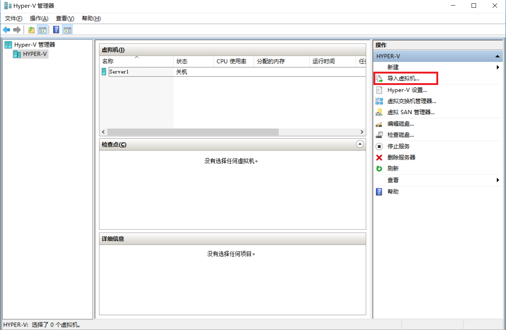
运行“导入虚拟机”向导，点击“下一步”
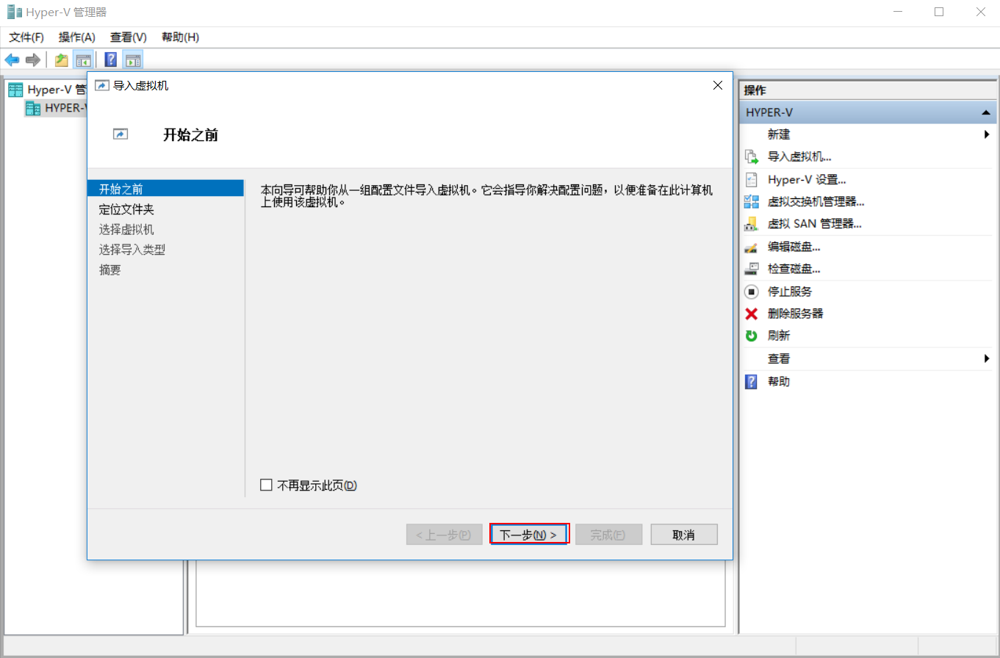
定位文件夹，就是要找到导出的虚拟机目录，这里点“浏览”
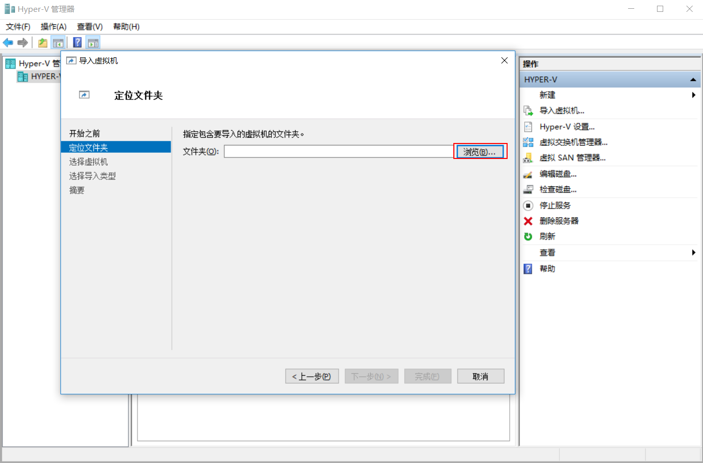
找到我们之前导出的虚拟机文件目录，点击“选择文件夹”
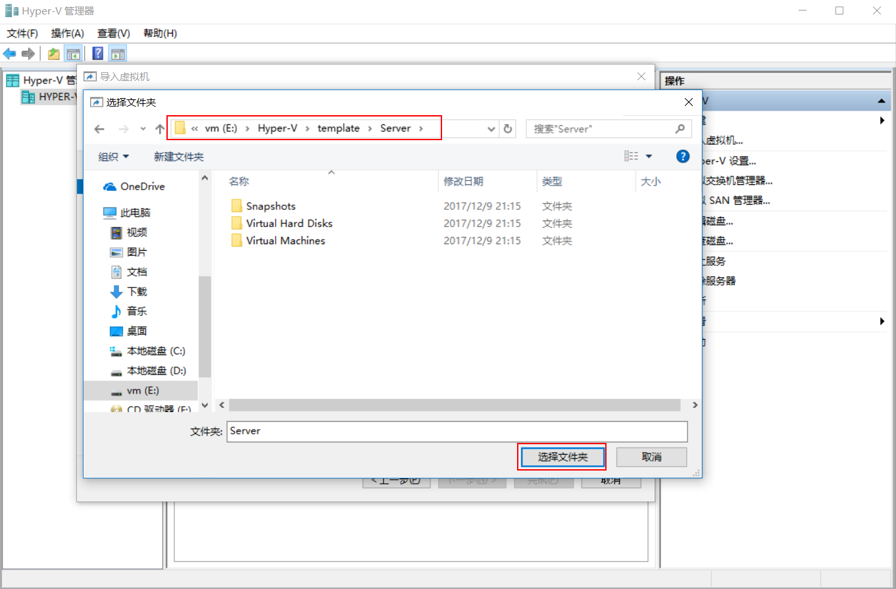
点击“下一步”
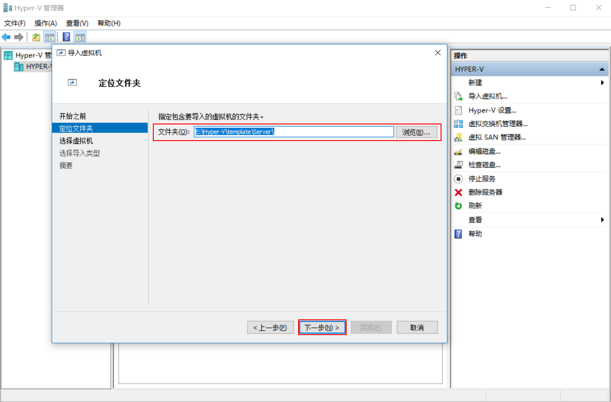
选择虚拟机，里面默认就只有一台虚拟机，点击“下一步”
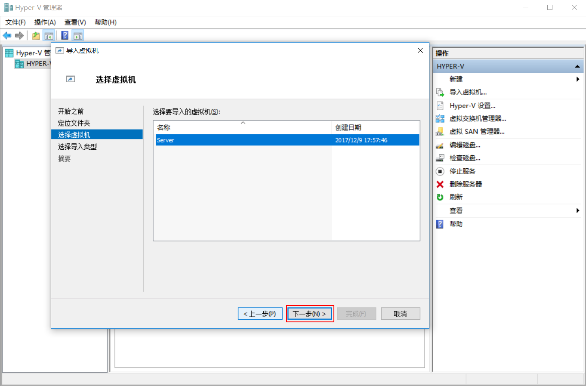
选择导入类型，我这里选择“复制虚拟机（创建新的唯一ID）”，当然也可以根据需要选择导入类型，然后点击“下一步”
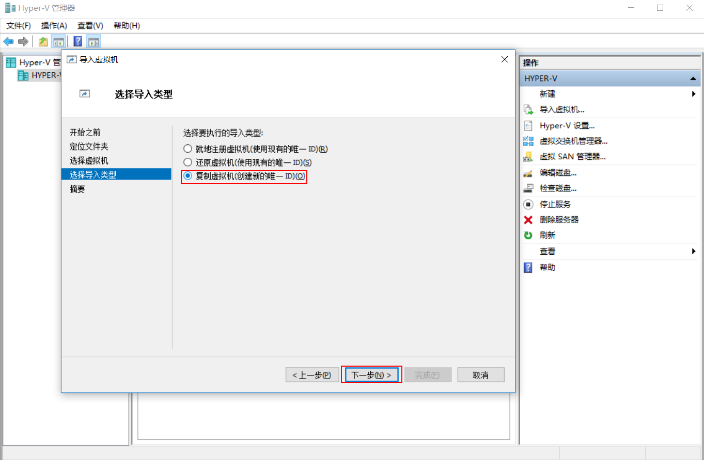
选择目标就是将虚拟机文件存放在什么位置，我这里都指定在E\Hyper-V\Server2文件夹，当然也可以默认，但我觉得这样不规范，点击“下一步”
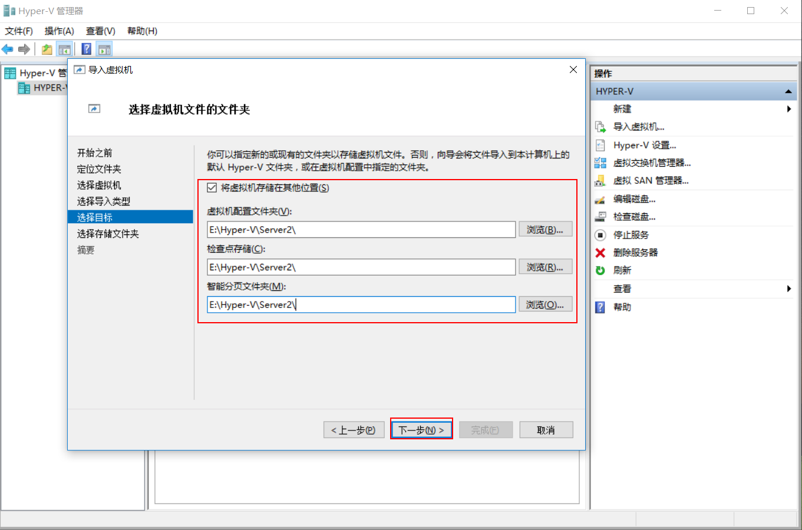
设置虚拟机硬盘的存放位置，我存放在E:\Hyper-V\Server2\Virtual Hard Disks\文件位置，点击“下一步”
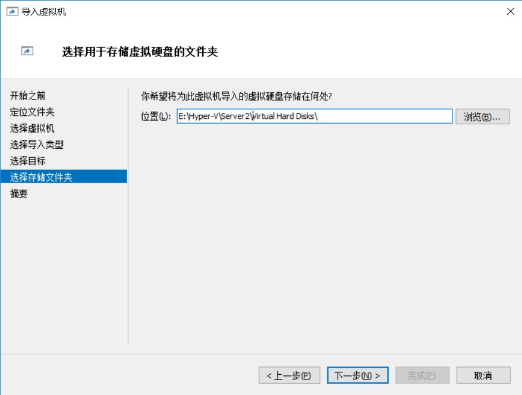
确认配置，点击“完成”
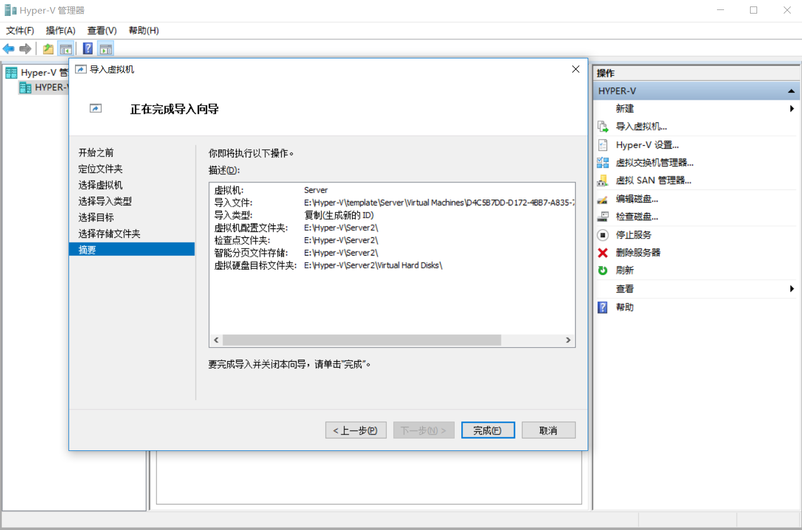
这时我们在Hyper-V管理器中可以看到导入的虚拟机Server了，导入虚拟机完成
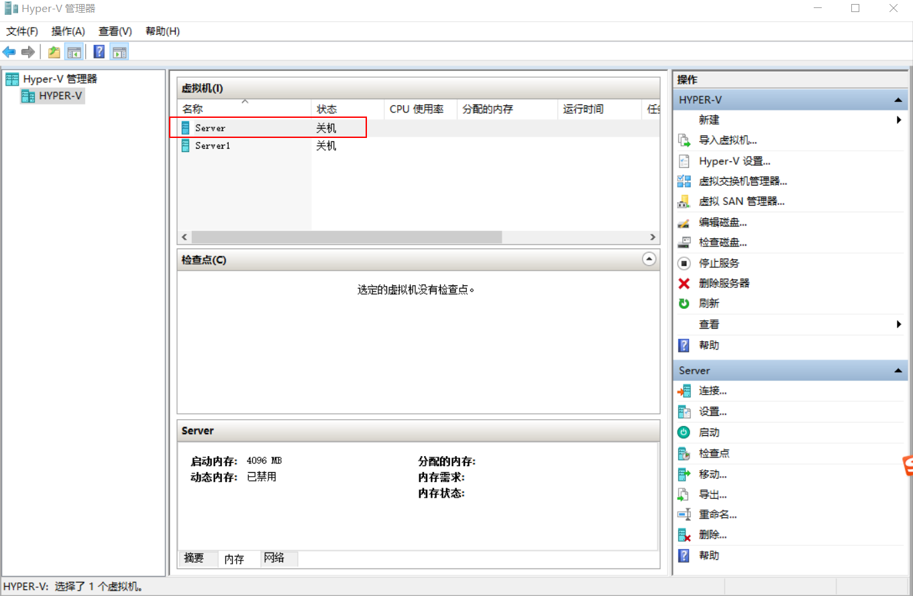