## Windows Server 2016 Hyper-V新建虚拟机
在Hyper-V服务器上打开“服务器管理器”-“工具”-“Hyper-V管理器”，打开“Hyper-V管理器”，或者点“开始”-“Windows管理工具”-“Hyper-V管理器”，打开“Hyper-V管理器”
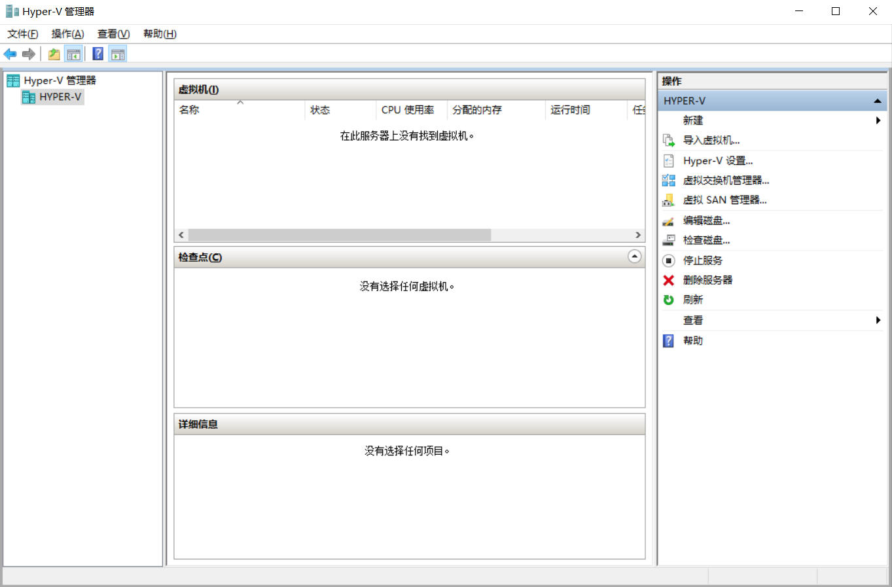
在“Hyper-V服务器”中，点击“新建”-“虚拟机”
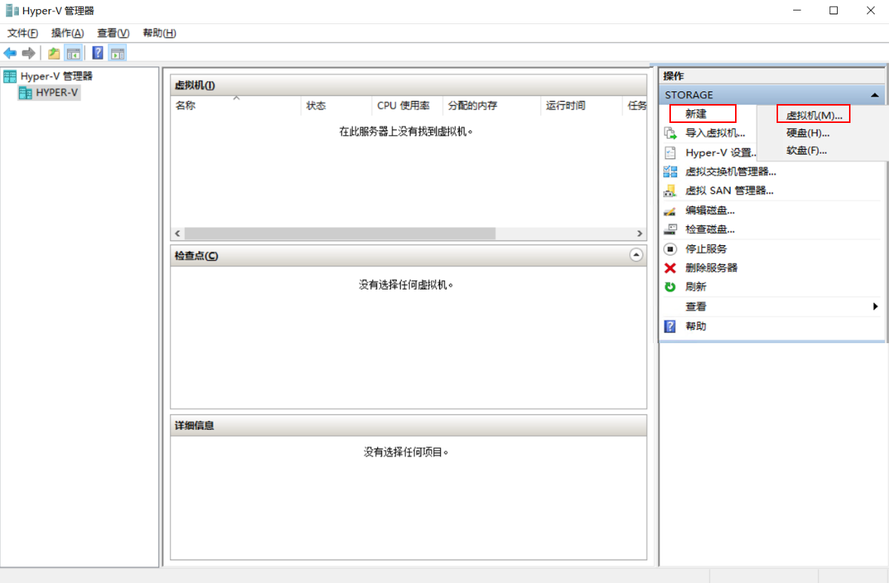
打开“新建虚拟机向导”，点击“下一步”
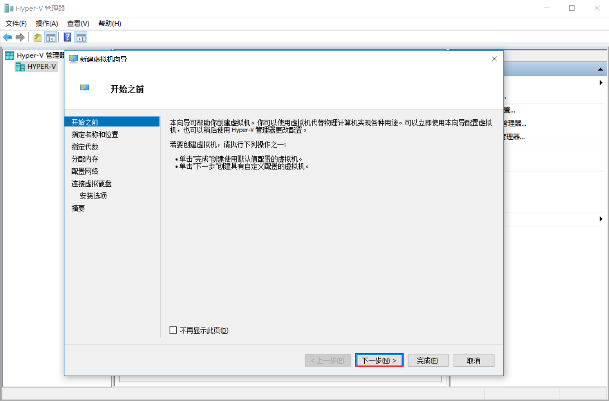
配置虚拟机的名称和位置，我们这里设置虚拟机名称为“Server”，存储位置“E:\Hyper-V\Server”，点击“下一步”
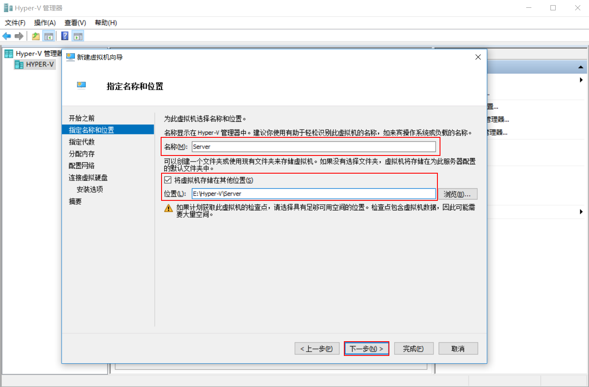
选择虚拟机代数，我们这里选择“第一代”，我觉得第一代兼容性好一些，第二代具有UEFI功能，选择好了，点击“下一步”
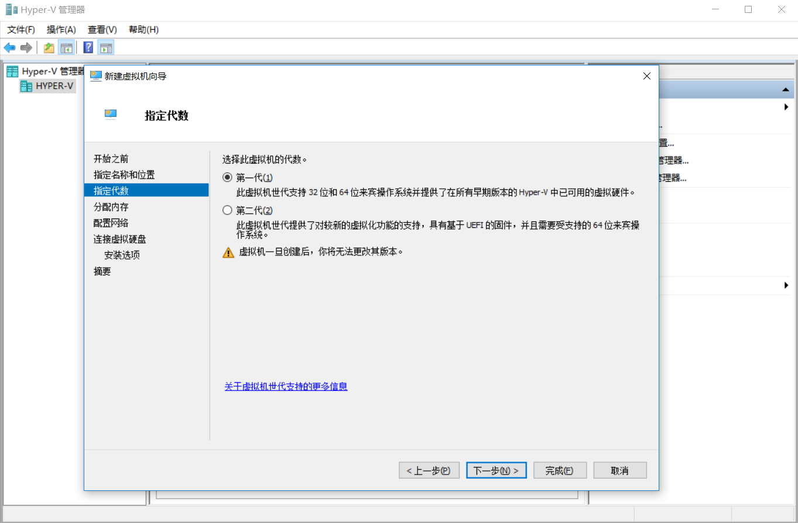
设置虚拟机的分配内存，我这里给虚拟机分配4G内存，当然也可以设置为动态内存，可以设置最低4GB，最高6GB，设置好了，点击“下一步”
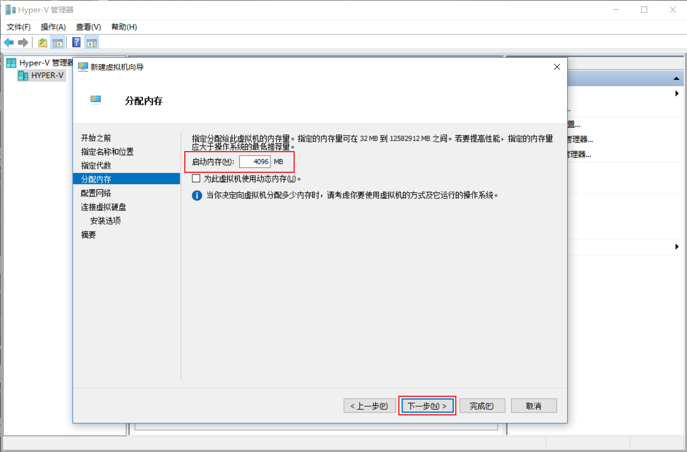
配置网络，连接建立的虚拟交换机“Switch”网络，点击“下一步”
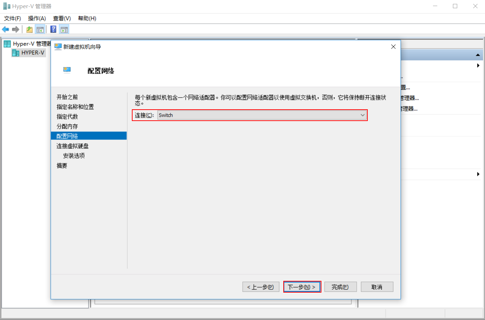
连接虚拟硬盘，选择“创建虚拟硬盘”，名称设置“Server.vhdx”，位置设置“E:\Hyper-V\Server\Server\Virtual Hard Disks\”，硬盘大小设置“127GB”，不过这都是默认的，我们可以根据自己的需要进行设置，如果不需要新建硬盘，可以设置可用的物理硬盘等，设置好了，点击“下一步”
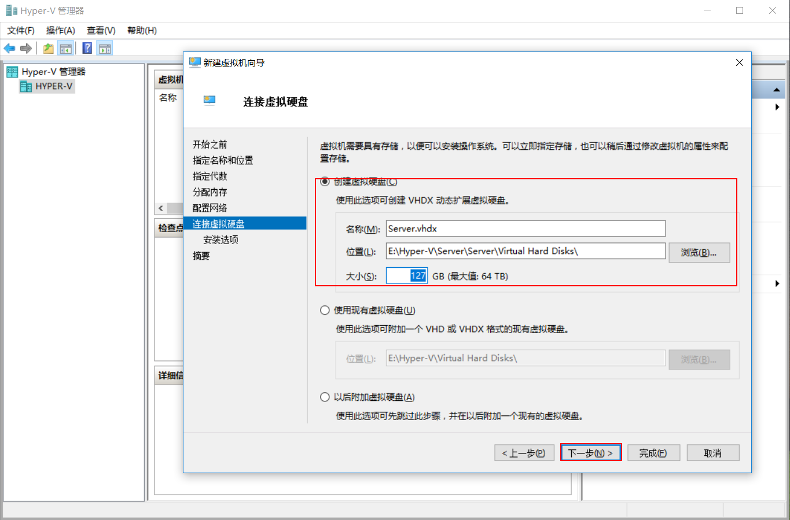
设置安装选项选择“从可启动的CD/DVD-ROM安装操作系统”，“映像文件”-“浏览”，找到“ISO”操作系统，点击“打开”
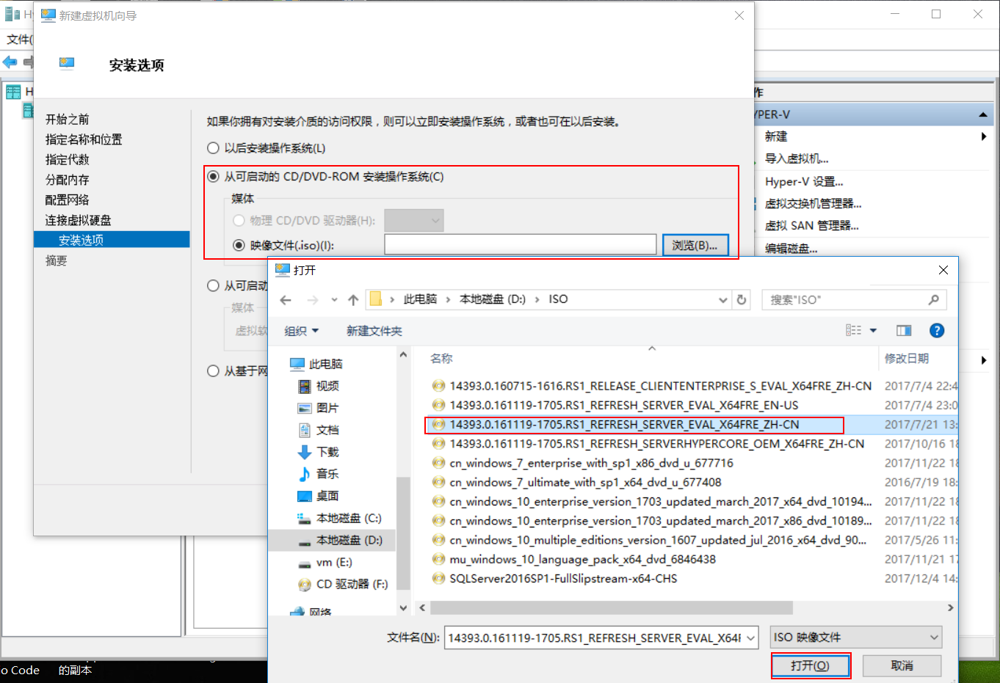
映像文件选择好了，点击“下一步”
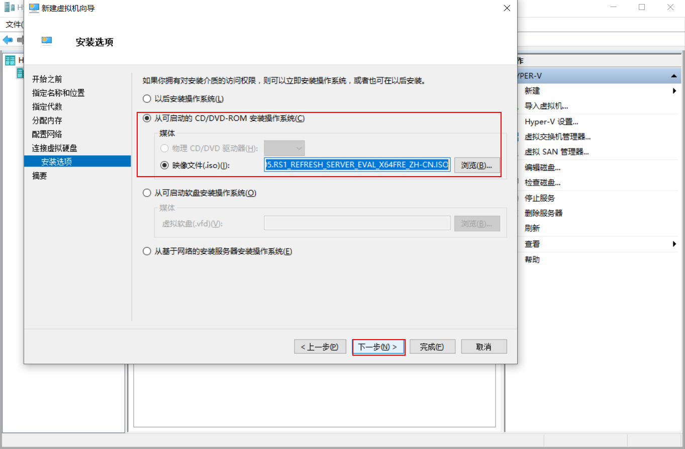
确认配置，点击“完成”
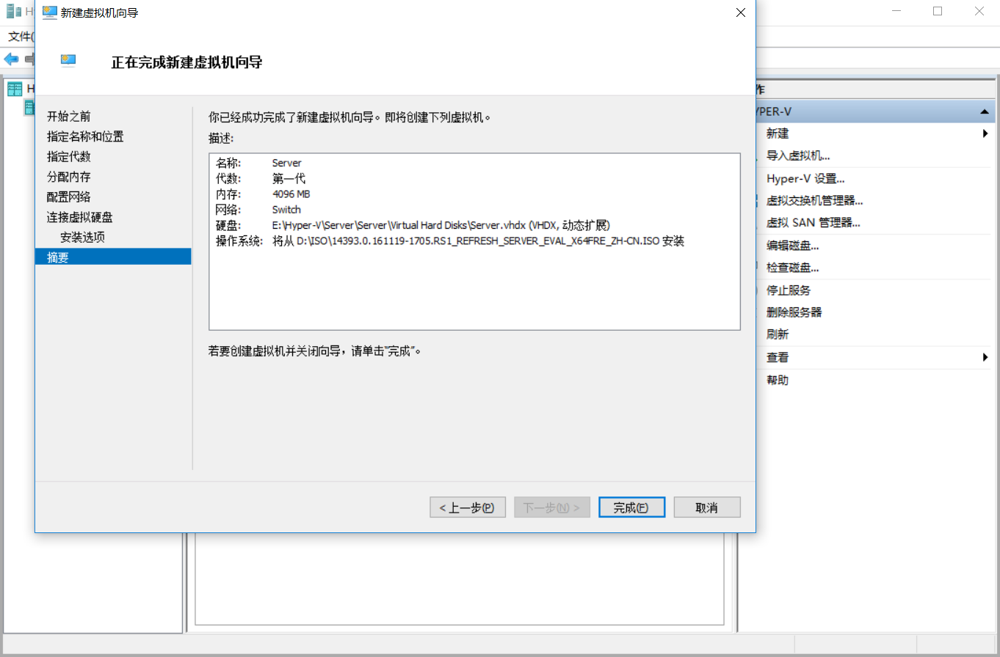
虚拟机新建完成了，这时可以在Hyper-V管理器中看到刚才新建的虚拟机了
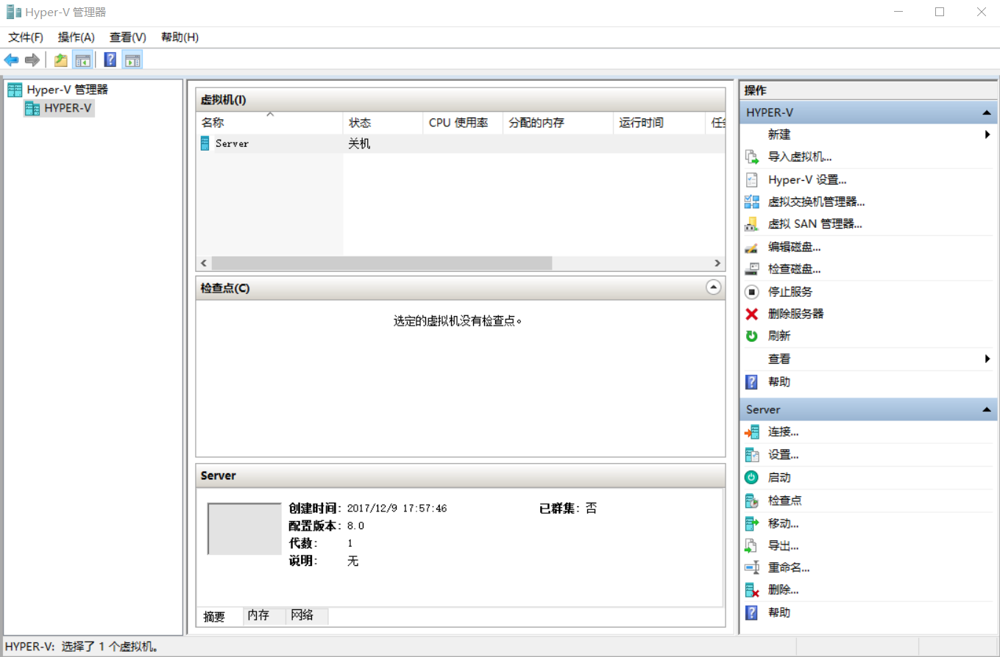
后面启动虚拟机，安装操作系统这里就不多说了。