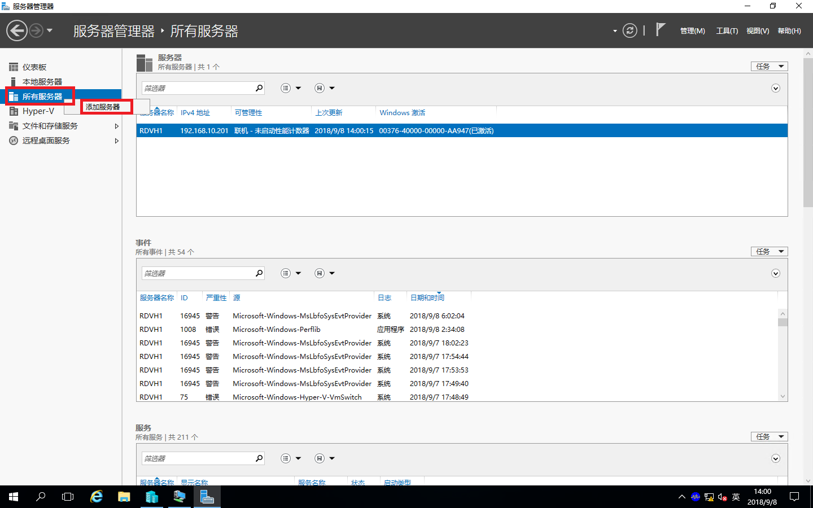
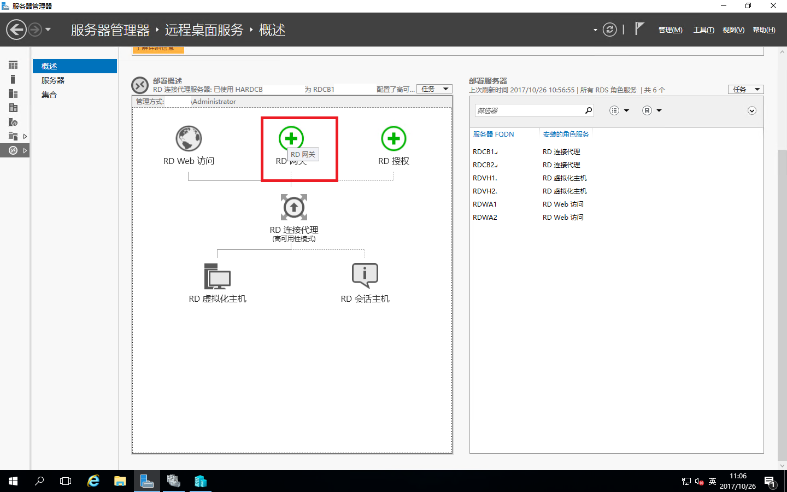
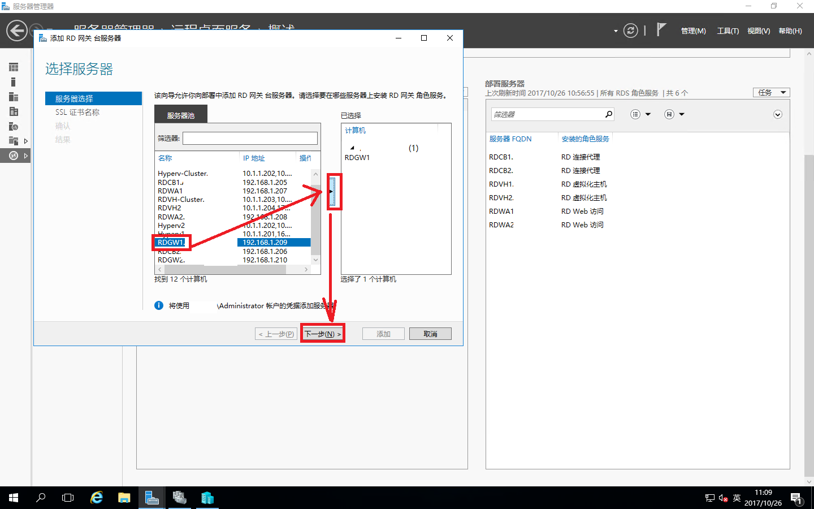
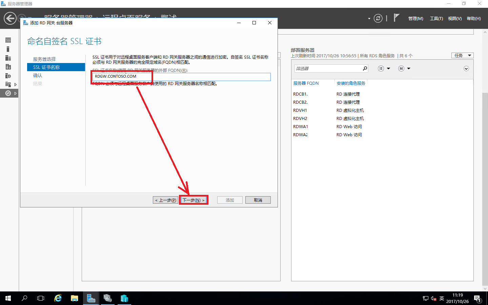
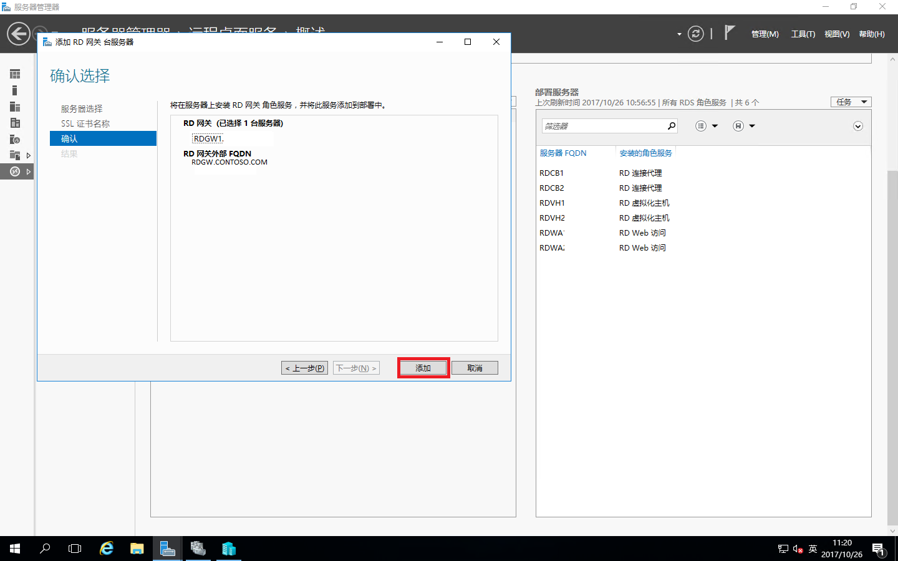
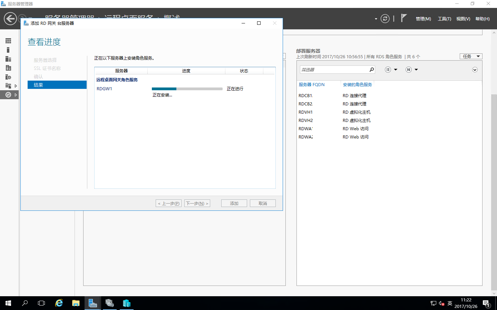
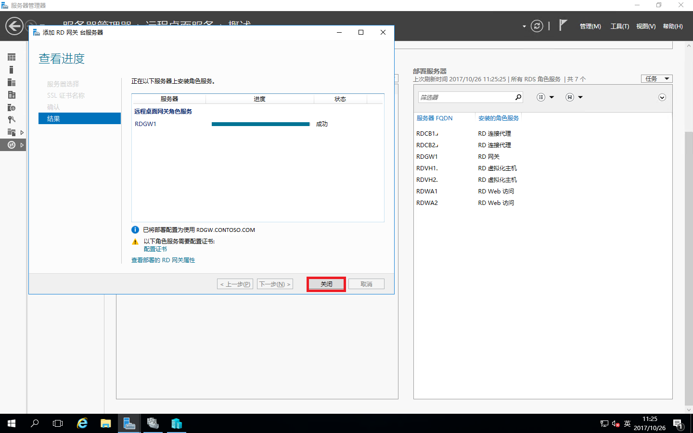
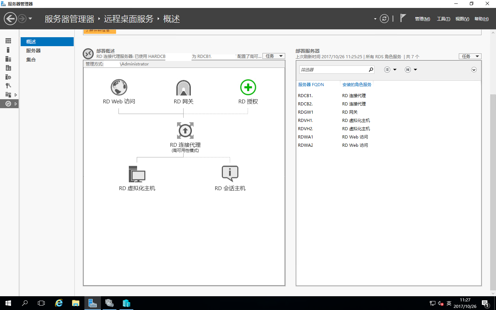

# Windows Server 2016之RDS部署之添加RD网关

紧接着前面的的RDS环境，我们不但的完善；在这里还是一样，我们需要准备一台服务器来做RD网关服务器；加入域中并且添加到RDCB服务器的“**服务器管理器-所有服务器**”中。  
**如下添加方式：**  
右击“服务器管理器”中的“所有服务器”-“添加服务器”即可

打开“服务器管理器”-“远程桌面服务”-“概述”，点击“RD网关”

将需要添加RD网关的服务器移动到已选择的计算机中，点“下一步”

设置RD网关的外部FQDN名称，点“下一步”

设置完成，确认配置，点击“添加”

正在添加

添加完成，点“关闭”

这时我们可以看到概述中右边的部署服务器里面已经有了RD网关了，不管部署多少RD网关都如同以上方式。
