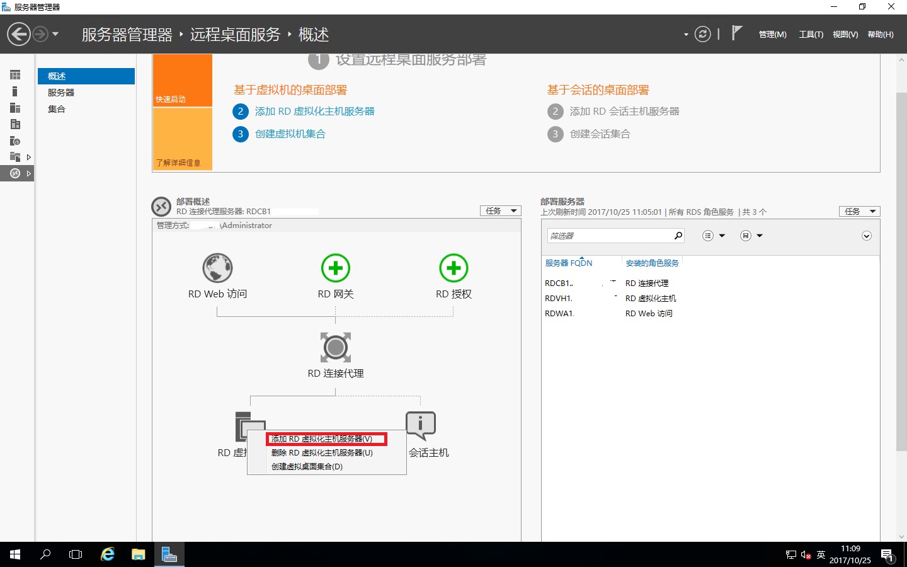
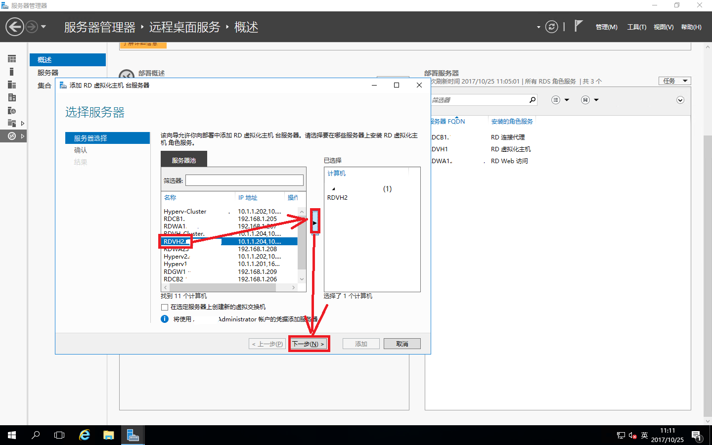
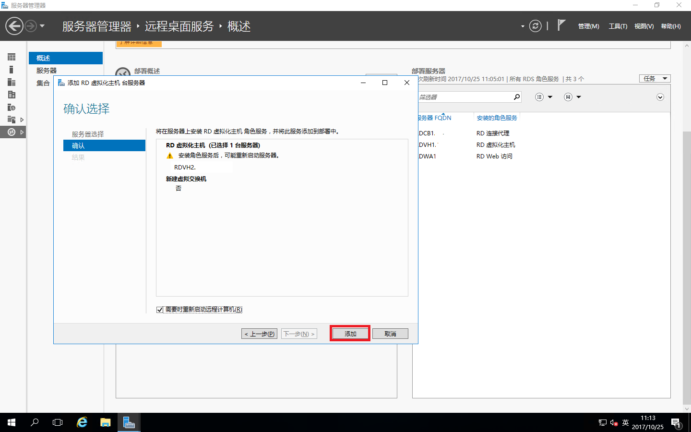
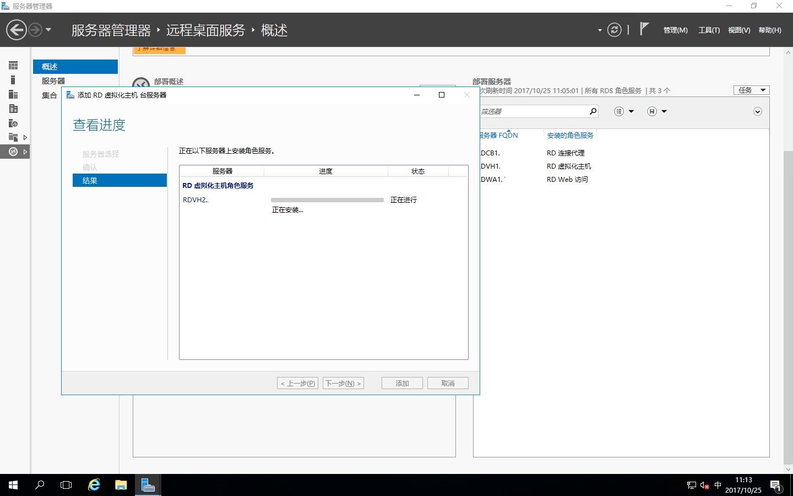
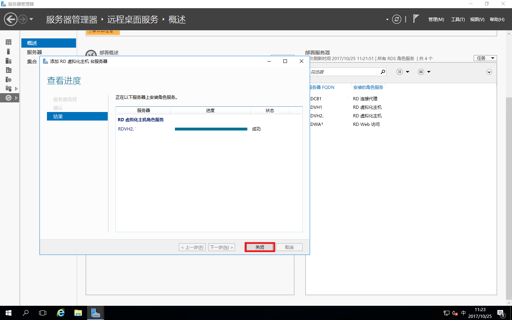

# Windows Server 2016之RDS部署之添加RD虚拟化主机

根据以下概述，可以看到RDS环境已经搭建好了，紧跟着下面我们要陆续的完善RDS整个部署，敬请期待吧！

进入“服务器管理器”-“远程桌面服务”-“概述”，右击“RD虚拟化主机”-“添加RD虚拟化主机服务器”

选择需要添加的RD虚拟化主机服务器移动到已选择里面，点“下一步”

确认配置，这里要将“需要时重新启动远程计算机”打勾，提示“RD虚拟化主机”需要重新启动，点“添加”

正在添加RD虚拟化主机服务器，如下是添加进度

添加的RD虚拟化主机重启后安装完成，点“关闭”

这时就可以在右边“部署服务器”里面看到刚才添加的RD虚拟化主机了
