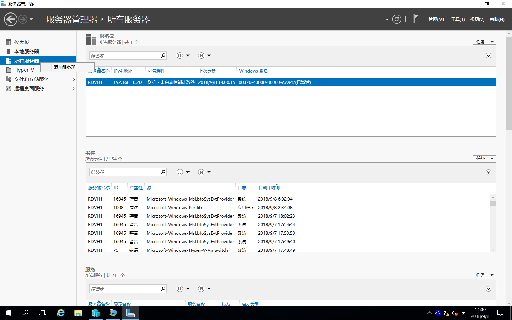
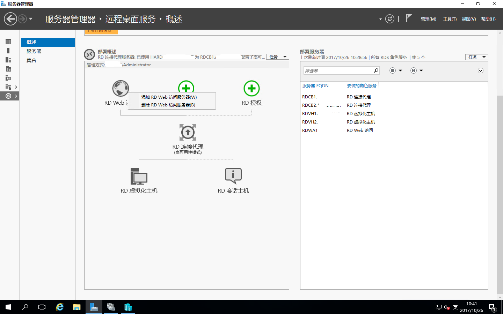
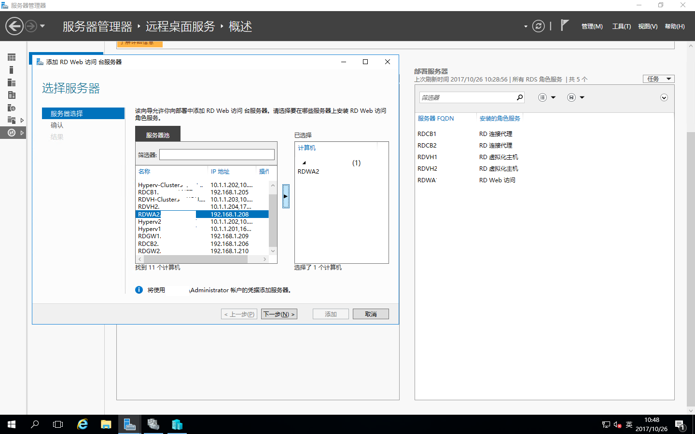
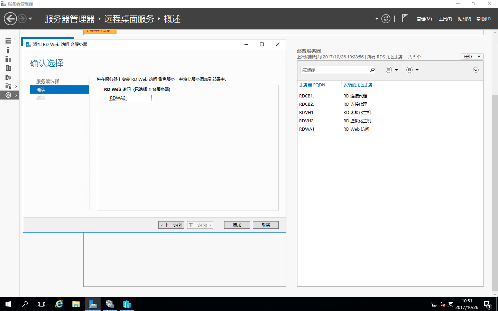
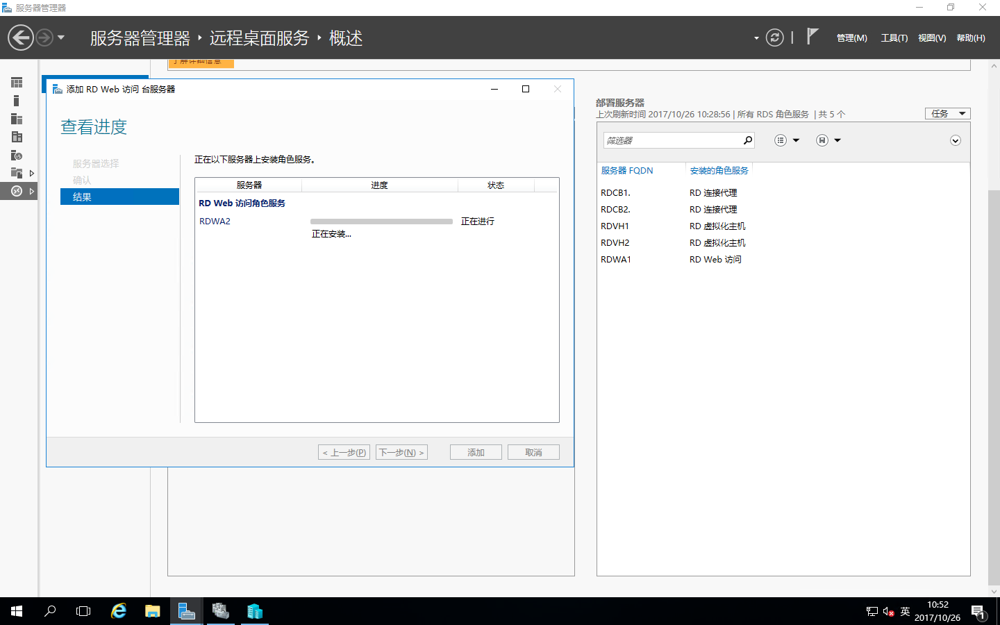
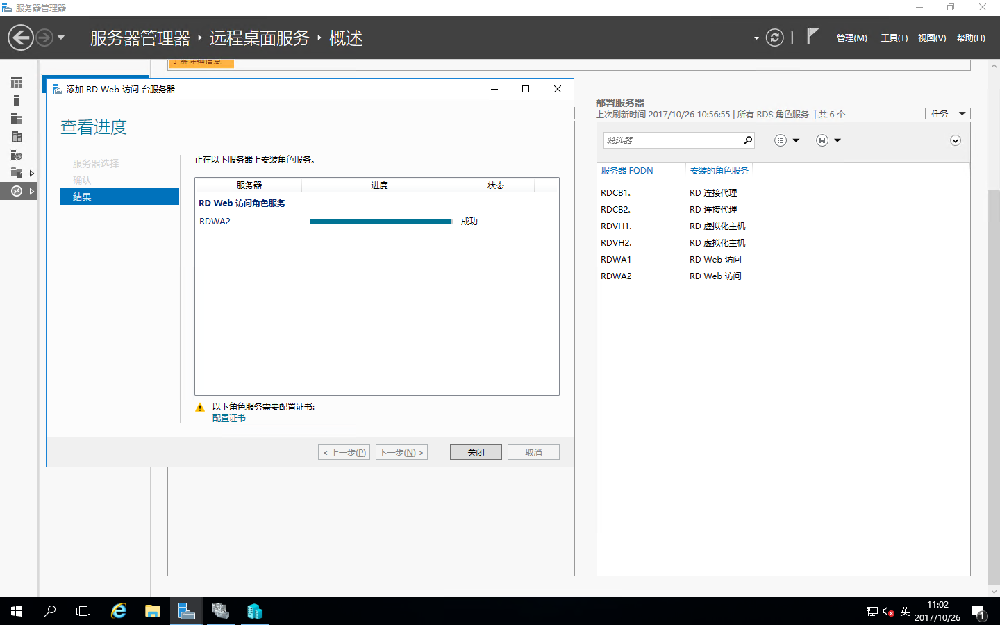
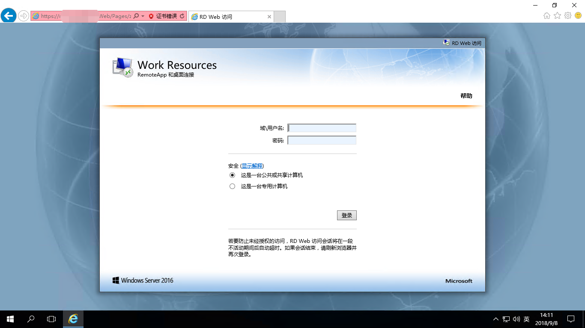

# Windows Server 2016之RDS部署之添加RD Web访问

前面几篇文章写了RDS的部署，RD连接代理的高可用以及添加RD虚拟化主机；今天我们添加RD Web访问服务器，首先，我们需要在原有的环境中重新准备一台服务器，作为RD Web访问服务器，加入域中并且添加到RDCB服务器的“**服务器管理器-所有服务器**”中。  
  
**如下添加方式：**  
右击“服务器管理器”中的“所有服务器”-“添加服务器”即可

打开“服务器管理器”-“远程桌面服务”-“概述”，右击“RD Web访问”，点“添加RD Web 访问服务器”

在服务器池里选择需要添加RD Web访问的计算机移动到已选择的计算机中，点“下一步”

确认配置，点“添加”

正在添加

RD Web访问服务器添加完成，点“关闭”，这样RD Web访问服务器就添加好了

测试一下
