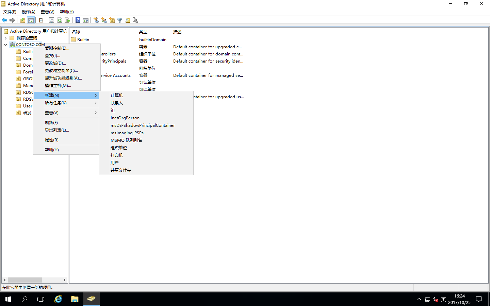
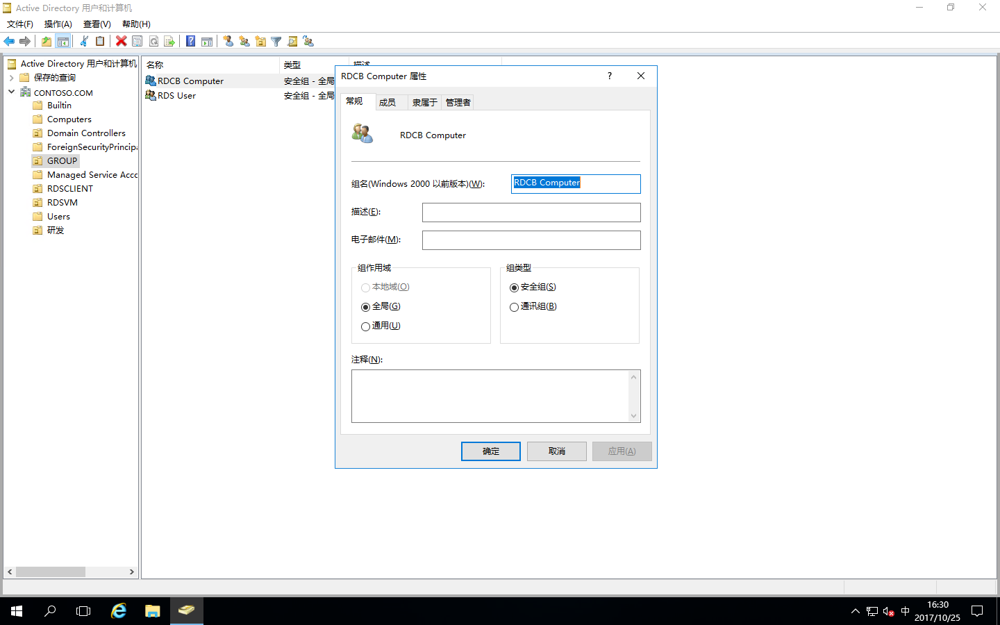
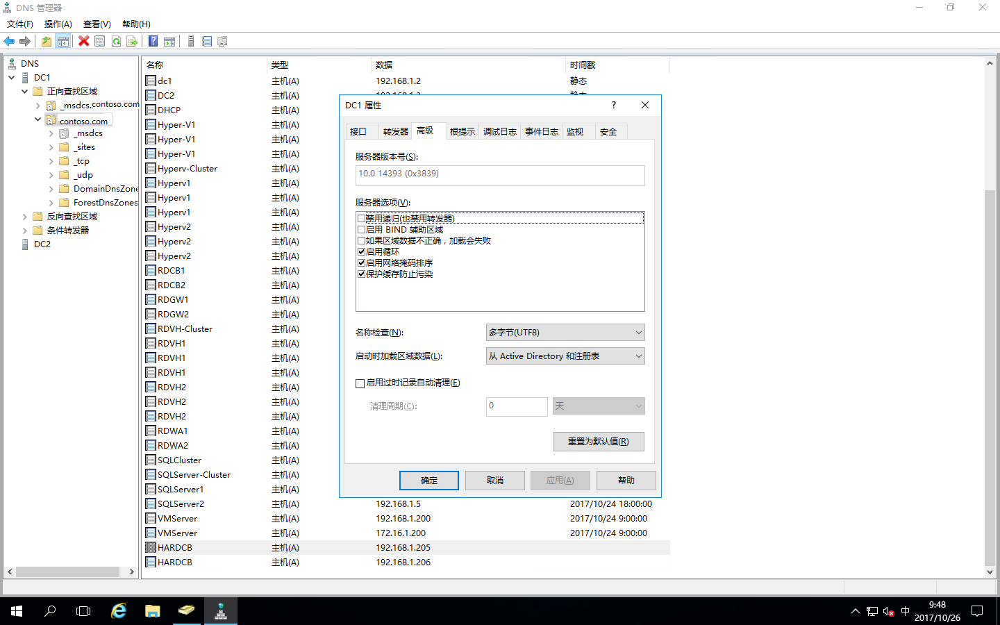
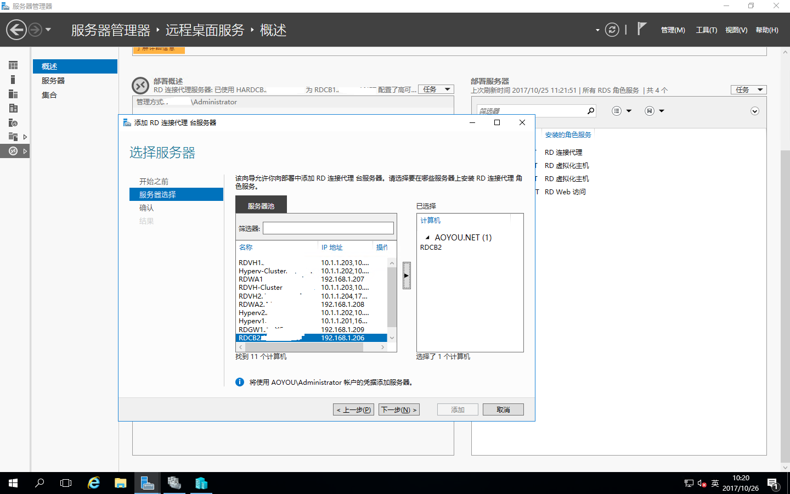

# Windows Server 2016之RDS部署之添加RD连接代理的高可用

根据以下概述，上片我简单写了一下RDS添加RD虚拟化主机，如下简单介绍RD连接代理的高可用；慢慢完善RDS整个部署，请敬请期待吧！

## 主题

- [部署环境](#部署环境)
- [先决条件](#先决条件)
- [配置高可用](#配置高可用)
- [添加服务器](#添加服务器)

##  部署环境

RD连接代理我这里也是使用的Windows Server 2016，这里只介绍RDCB服务器

| 编号 | 服务器名称 | IP地址 | 操作系统 |
| :---: | :-----:| :----: | :--- |
| 001 | RDCB1 | 192.168.1.205 | Windows Server 2016 Datacenter Evaluation |
| 002 | RDCB2 | 192.168.1.206 | Windows Server 2016 Datacenter Evaluation |

## 先决条件
### 1、将RDCB1和RDCB2加域。
  
### 2、RDCB高可用性部署时在域中的配置
进入AD1服务器，打开“Active Directory用户和计算机”  

右击“CONTOSO.COM”域名，“新建”-“组织单位”

运行新建注资单位向导，输入组织单位的名称：GROUP，点“确定”

点击GROUP这个组织单位，右击“组织单位”-“新建”-“组”

运行新建组的向导，设置组的名称，点“确定”

这是GROUP里面就会有“RDCB Computer”这个组了

双击“RDCB Computer”这个组，打开“RDCB Computer”组的属性

在“RDCB Computer”组中，点“成员”,添加成员，这里添加RDCB1和RDCB2这两台计算机，然后点确定即可

### 3、RDCB高可用性部署的数据库配置
配置RD连接代理的高可用性，必须要有SQL Server服务器，详见“[部署SQL Server](./../../DOCS/SQLServer/SQLServer2016-Install.md)”
打开“Microsoft SQL Server Managerment Studio 17”

打开“Microsoft SQL Server Managerment Studio 17”，点“连接”

进入数据库后，右击“数据库”-“新建数据库”

设置数据库名称，点“确定”

再把“安全性”-“登录名”展开，右击“登录名”-“新建登录名”

设置登录名

选择在AD里面创建的RDCB Computer这个组，点“确定”

登录名设置完成，设置默认数据库为RDCB，默认语言：English

点“服务器角色”，把dbcreator打勾

点“用户映射”，把“RDCB”打勾，对应的成员身份打勾（db_owner和public打勾），设置完成“确定”即可

### 4、在RDCB服务器安装SQL Server客户端
这里要将RDCB1和RDCB2同时安装SQL native client软件，有最新的安装最新的，我们这里安装
SQL native client 11
打开SQL Server客户端安装包路径，右击“安装”

直接点“运行”

直接点“下一步”

选择：我同意许可协议中条款，点“下一步”

选择功能里面把客户端组件和SQL Server Native Client SDK都安装，点“下一步”

这里点“安装”

SQL Server客户端安装完成，点“完成”

### 5、在RDCB服务器配置ODBC数据源
同时在RDCB1和RDCB2上设置ODBC数据源
点击“开始”-“Windows管理工具”-“ODBC数据源（64位）”

打开“ODBC数据源”窗口

点“添加”，选择“SQL Server Native Client 11.0”，点“完成”

创建SQL Server的新数据源，设置名称和数据库的连接服务器计算机名，点“下一步”

验证登录ID，选择默认，点“下一步”

把“更改默认的数据库为”打勾，并选择“RDCB”，点“下一步”

直接点“完成”

这里“确定”即可

这样就添加好了

这时在数据库服务器的磁盘上建立一个共享文件夹，用来存放RDCB数据库文件

RDCB服务器在这个文件夹必须有读写权限，这时我们将RDCB Computer组加到RDCB文件夹的权限组里，并赋予读写权限，然后“确定”完成即可

### 6、配置DNS循环
在DC域控服务器上打开DNS服务器，并展开到正向查找区域的域名文件夹

我们知道RDCB1的IP：192.168.1.205，RDCB2的IP：192.168.1.206，要将这个两个RDCB添加循环  
右击域名点“新建主机”

设置主机名称和IP地址，这里设置RDCB1的IP，点“添加主机”

在添加RDCB2的IP，点“添加主机”，然后点“完成”即可

这时我们可以在DNS里面看到两个新添加的HARDCB主机并用的是RDCB1和RDCB2的IP，这样DNS循环就完成了

右击DNS中DC1的“属性”，在点“高级”，看看循环是否启用，没启用要在“启用循环”前面打勾，然后“确定”

## 配置高可用  
  
打开“服务器管理器”-“远程桌面服务”-“概述”，可以看到如下RDS概述图

右击“RD连接代理”,点“配置高可用性”

运行“配置RD连接代理的高可用性”向导

这里选择默认选项，点“下一步”

配置高可用性  
RD连接代理群集的DNS名称：HARDCB.contoso.com（我们在DNS里面设置的)  
连接字符串：DRIVER=SQL Server Native Client 11.0;SERVER=<SQLserver名称>;Trusted_Connection=Yes;APP=Remote Desktop Services Connection Broker;Database=<要建立数据库的名称>（只针对 SQL Server Native Client 11.0的SQL Server客户端）  
用于存储数据库文件的文件夹：F:\RDCB（这是我们在SQL Server服务器中设置的共享文件夹）  
设置完成点“下一步

确认刚才的配置，点“配置”

配置RDCB连接代理的高可用已完成，点“关闭”

## 添加服务器
在添加RD连接代理服务器时先看一下SQL Server的权限有没有问题，打开SQL Server服务器的“Microsoft SQL Server Managerment Studio” 数据库管理工具，进入数据库，展开“安全性”-“登录名”，找到“contoso\RDCB Computer”这个用户，右击“属性”

打开RDCB Computer登录属性，点到“用户映射”，发现RDCB数据库没有勾选，也没有权限，这是因为我们在配置RD连接代理的时候设置的字符串把它重置了，这时我们需要把权限添加上去，才能添加新的RD连接代理服务器，不然会报错。

这时我们把“RDCB”数据库勾选，数据库角色成员身份中的“db_owner”和“public”勾选，然后“确定”即可。

以进行添加RD连接代理服务器了
打开“服务器管理器”-“远程桌面服务”-“概述”中，右击“RD连接代理”，点击“添加RD连接代理服务器”

运行“添加RD连接代理服务器”的向导，点“下一步”

将需要添加的RD连接代理服务器的计算机名称从服务器池移动到已选择的计算机里，点“下一步”

确认配置，点“添加”

正在添加RD连接代理服务器，如下安装进度

这里可以看到添加状态为“成功”，点“关闭”即可

这样我们在概述里面右边的部署服务器中就可以看新添加进来的RDCB2是RD连接代理服务器了，RD连接代理服务器就添加完成了。
