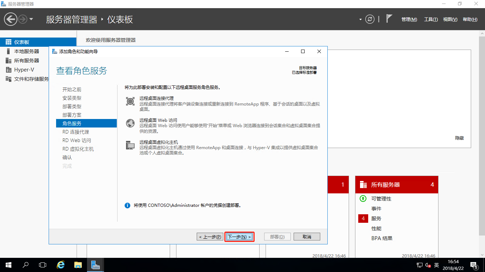

# Windows Server 2016之RDS部署

## 简述
RDS是Remote Desktop Service的简称，远程桌面服务加快并扩展了到任何设备的桌面和应用程序部署，在帮助保护关键知识产权的安全同时提高了工作人员的工作效率，简化了法规遵从性。 远程桌面服务启用虚拟机基础结构 (VDI)、基于会话的桌面以及应用程序，允许用户想在哪儿工作就在哪儿工作。如下我们介绍如何部署RDS？  

### RDS有6个角色服务：  
- **远程桌面Web访问：RD Web Access**  
远程桌面 Web 访问（RD Web 访问）允许用户通过运行 Windows的计算机上的“开始”菜单或通过网页浏览器访问 RemoteApp 和桌面连接。 RemoteApp 和“桌面连接”提供了会话集合中 RemoteApp 程序和基于会话的计算机的自定义视图，以及虚拟机集合中 RemoteApp 程序和虚拟机的自定义视图。
- **远程桌面网关：RD Gateway**  
远程桌面网关（RD 网关）让获得授权的用户可以从任何连接到 Internet 的设备连接到企业内部网络中的虚拟机、RemoteApp 程序和基于会话的计算机。
- **远程桌面授权：RD Licensing**  
远程桌面授权（RD 授权）管理连接到远程桌面会话主机服务器或虚拟机所需的许可证。 你可以使用 RD 授权来安装、颁发和跟踪许可证的可用性。
- **远程桌面连接代理：RD Connection Broker**  
远程桌面连接代理（RD 连接代理）：  
允许用户重新连接到其现有的虚拟机、RemoteApp 程序和基于会话的计算机。  
让你可以在会话集合中的 RD 会话主机服务器之间或在共用虚拟机集合的共用虚拟机之间平均分配负载。  
提供了对虚拟机集合中虚拟机的访问权限。
- **远程桌面虚拟化主机：RD Virtualization Host**  
远程桌面虚拟化主机（RD 虚拟化主机）与 Hyper-V 集成，可以在组织内部署虚拟机集合池或个人虚拟机集合。
- **远程桌面会话主机：RD Session Host**  
远程桌面会话主机（RD 会话主机）让服务器可以托管 RemoteApp 程序或基于会话的计算机。 用户可以连接到会话集合中的 RD 会话主机服务器，从而在这些服务器上运行程序、保存文件和使用资源。

## 主题

- [部署环境](#部署环境)
- [先决条件](#先决条件)
- [部署远程桌面服务](#部署远程桌面服务)

## 部署环境

| 编号 | 服务器名称 | IP地址 | 操作系统 |
| :---: | :-----:| :----: | :--- |
| 001 | AD1 | 192.168.100.250 | Windows Server 2016 Datacenter Evaluation |
| 002 | RDCB1 | 192.168.100.240| Windows Server 2016 Datacenter Evaluation |
| 003 | RDWA1 | 192.168.100.237| Windows Server 2016 Datacenter Evaluation |
| 004 | RDVH1 | 192.168.100.238| Windows Server 2016 Datacenter Evaluation |
| 005 | RDGW1 | 192.168.100.239| Windows Server 2016 Datacenter Evaluation |

## 先决条件

1、配置AD域控制器，如何配置AD域控制器请查看[创建AD域](./../../DOCS/AD/AD-Deployment.md) 
2、将RDCB1、RDWA1、RDVH1和RDGW1设置好静态IP，并加域。
3、为RDVH1安装Hyper-V角色。安装方式请参考[Windows Server 2016部署Hyper-V](./../../DOCS/Hyper-V/Hyper-V-Deployment.md)

## 部署远程桌面服务

**将服务器添加到所有服务器**  
  
登录到RDCB1服务器，打开“服务器管理器”，右击左边的“所有服务器”-“添加服务器”

弹出“添加服务器”对话框，名称中输入“RD”，因为我这里RDS服务器都是以RD开头的，点“立即查找”，可以看到查找出来的4台服务器，选中这4台服务器，点击向右箭头，然后点击“确定”

**部署远程桌面服务**

在“服务器管理器”-“仪表盘”，点击“添加角色和功能”

运行“添加角色和功能向导”，点击“下一步”

安装类型选择“远程桌面服务安装”，点击“下一步”

部署类型选择“标准部署”，点击“下一步”

部署方案选择“基于虚拟机的桌面部署”，点击“下一步”

角色服务，点击“下一步”

RD连接代理选择“RDCB1.contoso.com”,点击向右的箭头，然后点击“下一步”

RD Web访问选择“RDWA1.contoso.com”，点击向右的箭头，然后点击“下一步”

RD虚拟化主机选择“RDVH1.contoso.com”，点击向右的箭头，然后点击“下一步”

确认配置，勾选“需要时自动重新启动目标服务器”，点击“部署”

部署进度

部署完成，点击“关闭”

部署完成后，打开“服务器管理器”-“远程桌面服务”-“概述”
