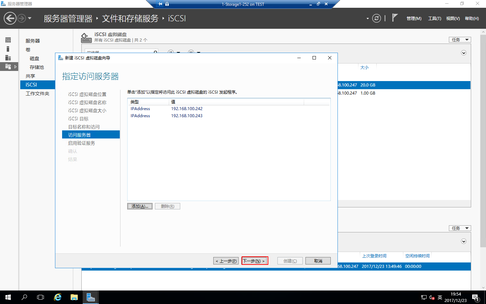
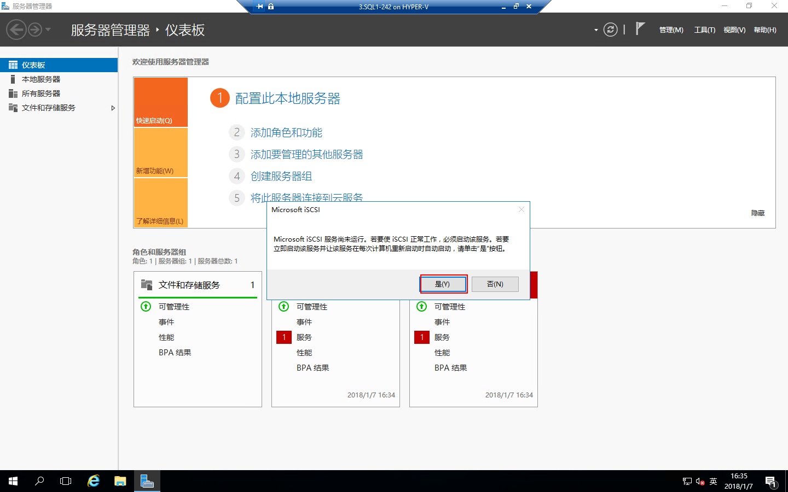
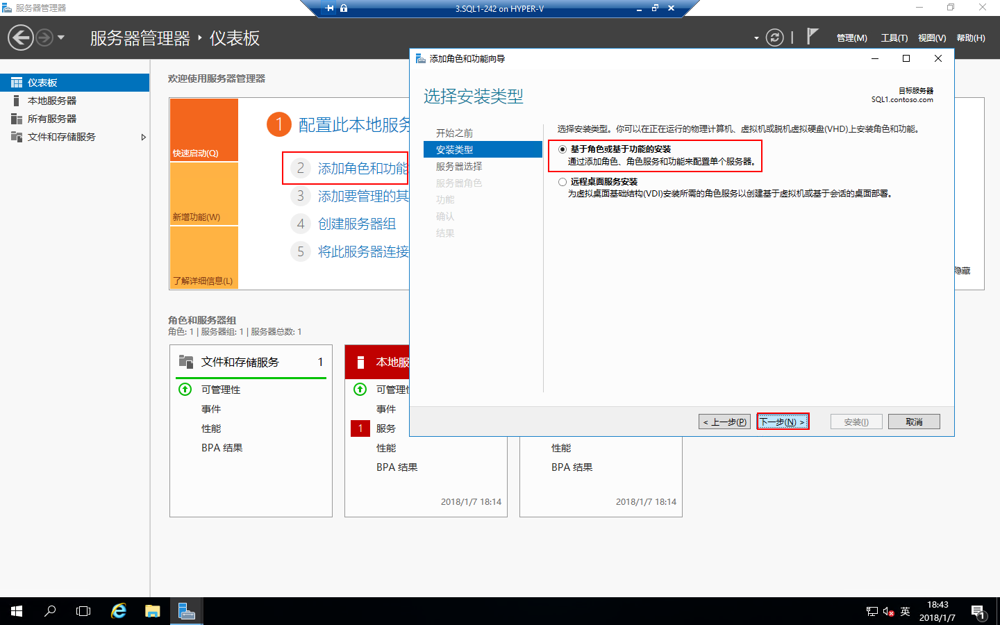
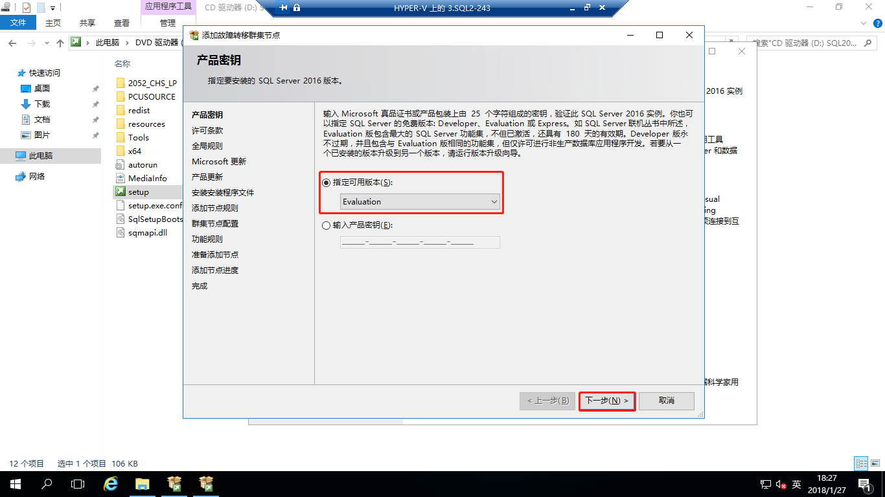
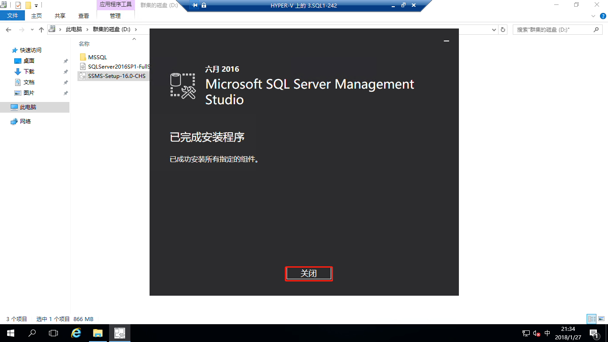

# Windows Server 2016中安装SQLServer2016 Failover Cluster
本文主要介绍如何在Windows Server 2016中部署SQLServer2016 Failover Cluster；什么是Failover Cluster，请查看[微软技术文档](https://docs.microsoft.com/zh-cn/windows-server/failover-clustering/failover-clustering-overview)。

## 主题

- [部署环境](#部署环境)
- [先决条件设置](#先决条件设置)
- [配置存储](#配置存储)
- [连接存储配置磁盘](#连接存储配置磁盘)
- [安装角色](#安装角色)
- [配置故障转移群集](#配置故障转移群集)
- [新的SQL Server故障转移群集安装](#新的)
- [向SQL Server故障转移群集添加节点](#向)
- [安装SQL Server管理工具](#安装)

## 部署环境

| 编号 | 服务器名称 | IP地址 | 操作系统 |
| :---: | :-----:| :----: | :--- |
| 001 | AD1 | 192.168.100.250 | Windows Server 2016 Datacenter Evaluation |
| 002 | Storage | 192.168.100.252| Windows Server 2016 Datacenter Evaluation |
| 003 | SQL1 | 192.168.100.242| Windows Server 2016 Datacenter Evaluation |
| 004 | SQL2 | 192.168.100.243| Windows Server 2016 Datacenter Evaluation |
| 005 | CSQL | 192.168.100.244 |  SQLServer Cluster | / |
| 006 | MSSQL | 192.168.100.245 |  SQLServer Service | / |

## 先决条件设置

1、配置AD域控制器，如何配置AD域控制器请查看[创建AD域](./../../DOCS/AD/AD-Deployment.md)  
2、部署Storage，如何配置存储请查看[部署Storage](./../../DOCS/Storage/Storage-ISCSI-Configuration.md)  
3、设置IP地址，DNS指向域控制器IP  
4、安装用户这里使用域管理员，或者新建一个域用户，需拥有域管理员权限，要拥有域中，活动目录中的Computers这个目录的创建计算机的权限，及拥有SQL1和SQL2中本地超级管理员组的权限。

SQL1:  
IP Address：192.168.100.242   
Netmask：255.255.255.0  
Gateway：192.168.100.1  
DNS：192.168.100.250   

SQL2:  
IP Address：192.168.100.243  
Netmask：255.255.255.0    
Gateway：192.168.100.1  
DNS：192.168.100.250

4、设置计算机名，加入contoso.com域

## 配置存储

在Storage服务器上，需要创建两个ISCSI虚拟磁盘，给SQLServer的群集使用  
打开“服务器管理器”，点击“文件和存储服务”

进入“文件和存储服务”，点“ISCSI”，选择“任务”-“新建ISCSI虚拟磁盘”

运行“新建ISCSI虚拟磁盘向导”，配置“ISCSI虚拟磁盘位置”为F盘，点击“下一步”

指定ISCSI虚拟磁盘名称，点击“下一步”

指定ISCSI虚拟磁盘大小，点击“下一步”

分配ISCSI目标，这里选择“新建ISCSI目标”，点击“下一步”

设置ISCSI目标名称，点击“下一步”

设置访问服务器，点“添加”，选择用于标识发起程序的方法选择“输入选定类型的值”，类型为“IP地址”，值为“192.168.100.242”，点击“确定”

再添加一个“192.168.100.243”IP地址类型的值，点击“确定”

访问服务器设置好了，点击“下一步”

启用验证服务这里，直接点“下一步”

确认配置，点击“创建”

创建完成，点击“关闭”

再新建一个仲裁见证盘，依然在ISCSI里面，点“任务”-“新建ISCSI虚拟磁盘”

运行“新建ISCSI虚拟磁盘向导”，设置ISCSI虚拟磁盘位置，这里选择在F盘，点击“下一步”

设置ISCSI虚拟磁盘名称，点击“下一步”

设置ISCSI虚拟磁盘大小，点击“下一步”

ISCSI目标选择“现有ISCSI目标”，目标名称选择“mssql192”，点击“下一步”

确认配置，点击“创建”

创建完成，点击“关闭”

这时Storage就已经设置好了

## 连接存储配置磁盘

**连接存储配置磁盘**SQL1服务器和SQL服务器都需连接存储，SQL1服务器配置与SQL2服务器配置一样，配置如下。  
在SQL1服务器上打开“服务器管理器”，点“工具”-“ISCSI发起程序”

提示“Microsoft ISCSI服务尚未运行，若要使ISCSI正常工作，必须启动该服务...”，点击“是”

打开“ISCSI 发起程序”属性，在“目标”栏输入存储服务器的IP地址“192.168.100.252”，点击“快速连接”，然后看到发现的目标状态显示“已连接”，然后点“完成”，再点“完成”，这样连接存储就完成了

右击SQL1服务器的“开始”，点击“磁盘管理”

打开“磁盘管理”，右击连接的磁盘1点“联机”

右击连接的磁盘2点“联机”

右击磁盘1点击“初始化磁盘”

初始化磁盘，选中“磁盘1”和“磁盘2”，点击“确定”

右击“磁盘1”-“新建简单卷”

设置卷大小

设置驱动器磁盘

设置格式化分区

完成新建简单卷

右击“磁盘1”-“新建简单卷”

设置卷大小

设置驱动器磁盘

设置格式化分区

完成新建简单卷

配置磁盘完成

## 安装角色

**安装角色**SQL1服务器配置和SQL2服务器配置一样，操作如下。

在SQL1服务器上打开“服务器管理器”，点击“添加角色和功能”，安装类型选择“基于角色或基于功能的安装”，点击“下一步”

服务器选择服务器池中的服务器，点击“下一步”

服务器角色点击“下一步”

功能选择“故障转移群集”，点击“下一步”

确认配置，点击“安装”

角色安装完成，点击“关闭”

## 配置故障转移群集

在SQL1服务器上打开“服务器管理器”，点“工具”-“故障转移群集管理器”，或点击“开始”-“Windows管理工具”-“故障转移群集管理器”，来打开“故障转移群集管理器”

打开“故障转移群集管理器”后，我们先“验证配置”

打开“验证配置向导”，点击“下一步”

选择服务器或群集，点击“浏览”，选择计算机，输入对象名称后检查名称，点击“确定”

选择服务器完成，点击“下一步”

测试选项选择“运行所有测试（推荐）”，点击“下一步”

确认，点击“下一步”

验证完成，点击“完成”

验证完成后，点击“创建群集”

打开“创建群集向导”，点击“下一步”

选择服务器或群集，点“浏览”，选择计算机，输入对象名称，点“检查名称”，点击“确定”

服务器选择完成，点击“下一步”

用于管理群集的访问点，输入群集名称及群集地址，点击“下一步”

确认配置，点击“下一步”

已经成功创建群集，点击“完成”

展开群集，点“节点”，可以看到SQL1和SQL2两个节点

再展开存储，点“磁盘”，可以看到两块磁盘，一块可用存储，一块仲裁中的磁盘见证，这样群集就创建完成了

## 新的SQL Server故障转移群集安装

在SQL1上将下载的SQL Server ISO安装程序，进行装载，进入安装程序目录双击“Setup.exe”，打开“SQL Server安装中心”

在“SQL Server安装中心”，点“安装”-“新的SQL Server故障转移群集安装”

打开“安装SQL Server故障转移群集”，这里选择“Evaluation”版，点击“下一步” 

许可条款，勾选“我接受许可条款”，点击“下一步”

全局规则验证通过，点击“下一步”

由于SQL Server安装包都是最新的，这里就不更新了，节省时间，点击“下一步”

产品更新，点击“下一步”

安装故障转移群集规则验证通过，点击“下一步”

安装SQL Server功能选择自己需要的进行勾选，点击“下一步”

实例配置，输入“SQL Server网络名称”，点击“下一步”

群集资源组中可以看到故障转移群集中的磁盘，点击“下一步”

群集磁盘选择，这里已经自动选择“群集磁盘1”，点击“下一步”

群集网络配置，配置群集IP地址，点击“下一步”

指定服务帐户，点击“下一步”

指定排序规则，根据需要进行选择，点“自定义”，选择“SQL排序规则...”,点击“确定”

点击“下一步”

指定数据库引擎身份验证安全模式、管理员

指定数据目录，点击“下一步”

Reporting Service配置默认就好，点击“下一步”

功能配置规则验证通过，点击“下一步”

确认配置，点击“安装”

安装完成，点击“关闭”

## 向SQL Server故障转移群集添加节点

在SQL2上将下载的SQL Server ISO安装程序，进行装载，进入安装程序目录双击“Setup.exe”，打开“SQL Server安装中心”

在“SQL Server安装中心”，点“安装”-“向SQL Server故障转移群集添加节点”

打开“添加故障转移群集节点”向导，这里选择“Evaluation”版，点击“下一步”

许可条款，勾选“我接受许可条款”，点击“下一步”

全局规则验证通过，点击“下一步”

由于SQL Server安装包都是最新的，这里就不更新了，节省时间，点击“下一步”

产品更新，点击“下一步”

添加节点规则验证通过，点击“下一步”

群集节点配置，点击“下一下”

群集网络配置，点击“下一步”

服务帐户配置，点击“下一步”

功能规则验证完成，点击“下一步”

准备添加节点确定，点击“安装”

节点添加完成，点击“关闭”

## 验证SQL Server服务是否成功

现在我们可以看到“故障转移群集管理器”-“角色”中，所有者节点为“SQL1”

右击“SQL Server”-“移动”-“最佳节点”

这时我们可以看到所有者节点为“SQL2”，验证SQL Server服务成功

## 安装SQL Server管理工具

现在回到SQL1服务器上，SQL Server 2016安装包不带SQL Server管理工具，所有需要自己下载，单独安装，双击“SSMS-Setup-16.0-CHS.exe”，运行“Microsoft SQL Server Management Studio”，点击“安装”

正在安装

SQL Server管理工具安装完成，点击“关闭”

点“开始”-“Microsoft  SQL Server 2016”-“Microsoft SQL Server Managerment Studio”

打开“Microsoft SQL Server Managerment Studio”，服务器名称已经自动输入刚才创建的SQL Server网络名称，点击“连接”

群集SQL Server登录成功
