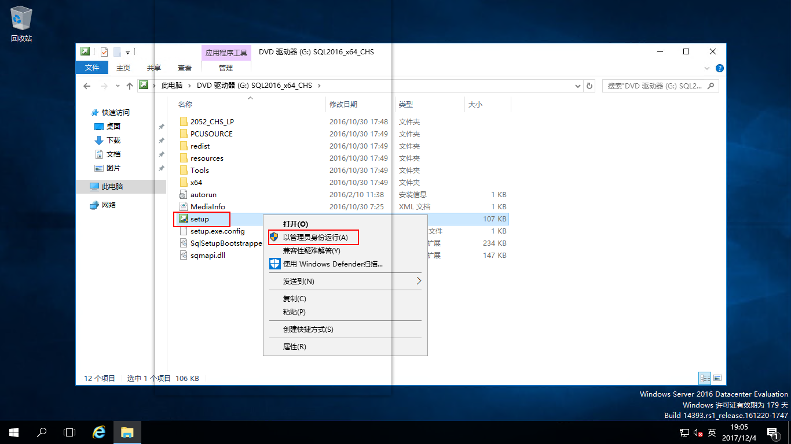

# SQL Server 2016的安装

[SQL Server](https://docs.microsoft.com/zh-cn/sql/sql-server/sql-server-technical-documentation)是Microsoft 公司推出的关系型数据库管理系统，SQL Server 是 Microsoft 数据平台的核心部分， SQL Server 在操作数据库管理系统 (ODBMS) 中处于领先水平。更多SQL Server文档请查看[微软官方文档](https://technet.microsoft.com/zh-cn/library/mt803150(v=sql.1).aspx)，本文档详细介绍SQL Server的安装部分。

## 主题
- [安装环境](#安装环境)
- [所需软件](#所需软件)
- [准备工作](#准备工作)
- [安装软件](#安装软件)

## 安装环境

| 编号 | 服务器名称 | IP地址 | 操作系统 |
| :--: | :---: | :----:| :--- |
| 001 | AD1 | 192.168.100.250 | Windows Server 2016 Datacenter Evaluation |
| 002 | SQLServer | 192.168.100.247 | SQL Server 2016 Evaluation |

## 所需软件

SQLServer2016-SSEI-Eval

## 准备工作

1、部署AD域控制器，见[AD域控制器部署部分](./../../DOCS/AD/AD-Deployment.md) \
2、将SQL Server服务器的IP地址设置成手动指定，DNS指向AD域服务器IP \

3、将SQL Server服务器加入域中（加域完成后重启服务器）

4、在AD域服务器中新建一个SQLServer用户，创建用户见[新建用户部分](./../../DOCS/AD/AD-New-OU.md) \
5、将SQLServer用户添加到安装SQL Server服务器的本地管理员组，并以SQLServer用户登录到SQL Server服务器来安装SQL Server

## 安装软件

将SQL Server光盘映像文件下载到D盘，右击文件进行“装载”

光盘映像文件装载完成，找到“setup.exe”右击“以管理员身份运行”

这里会提示验证，点击“是”

打开“SQLServer安装中心”，选择“安装”，点击“全新SQLServer独立安装或向现有安装添加新功能”，运行“SQL Server安装程序”向导，产品密钥选择“指定可用版本”，我们使用评估版进行实验，点击“下一步”

许可条款，把“我接受许可条款”打勾，点击“下一步”

Microsoft更新这里直接点击“下一步”

产品更新不用管，点击“下一步”

安装规则验证通过，点击“下一步”

功能选择根据自己的需要进行选择，我们这里就选择这些常用的，安装功能的存储位置这里就让它默认安装在C盘，点击“下一步”

功能规则，点击“下一步”，一般验证通过都会直接跳过

实例配置选择“默认实例”，点击“下一步”，当然也可以自己命名实例

服务帐户的帐户名默认已经设置好了，这里我们不用设置，点击“排序规则”

在“排序规则”中选择“自定义”，打开“自定义SQL Server 2016数据库引擎排序规则”窗口，选择“SQL排序规则，用于向后兼容”，选中“SQL_Latin1_General_CP1_CI_AS"点击“确定”，后面在安装SCCM的时候有明确要求SQL Server排序规则需要使用“SQL_Latin1_General_CP1_CI_AS”，当然如果后面不使用SCCM系统，排序规则也可以默认设置

排序规则设置完成，点击“下一步”

数据库引擎配置，服务器配置，点击“添加当前用户”为指定SQL Server管理员

当然，也可以添加更多管理员，点“添加”，弹出“选择用户、计算机、服务帐户或组”对话框，输入对象名称“Administrator”用户或者是计算机、组等，然后点“检查名称”，这里是添加的AD域用户，点击“确定”

指定SQL Server管理员设置完成，点击“数据目录”

设置数据库的存放位置，我们这里把它存放在D:\MSSQL\目录下，点击“下一步”

Reporting Service配置，这里默认就好，点击“下一步”

功能规则验证完成，点击“下一步”，一般验证通过会自动跳过

都设置好了，确认配置，点击“安装”

正在安装

SQL Server2016安装完成，点击“关闭”
