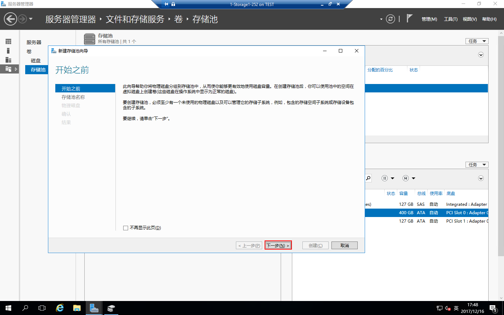
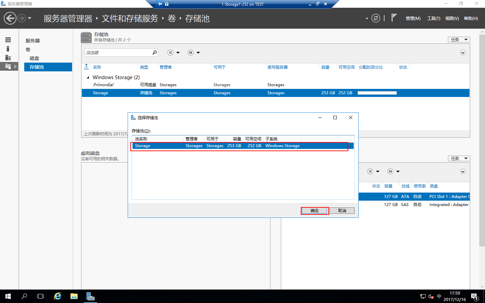

# Windows Server 2016 存储池和ISCSI

本文部署存储池，创建虚拟硬盘，新建卷，配置ISCSI目标服务器，将存储虚拟化。这里新建ISCSI虚拟磁盘是和群集故障转移结合，从而达到群集功能。

## 主题：

- [部署环境](#部署环境)
- [先决条件](#先决条件)
- [配置存储池](#配置存储池)
- [创建虚拟硬盘](#创建虚拟硬盘)
- [新建卷](#新建卷)
- [安装角色](#安装角色)
- [配置ISCSI](#配置ISCSI)

## 部署环境

| 编号 | 服务器名称 | IP地址 | 操作系统 |
| :---: | :-----: | :------: | :-----|
| 001 | AD1 | 192.168.100.250 | Windows Server 2016 Datacenter Evaluation |
| 002 | Storage | 192.168.100.252 | Windows Server 2016 Datacenter Evaluation |

## 先决条件

1、配置AD域控制器，[创建AD域](./../../DOCS/AD/AD-Deployment.md)  
2、设置IP地址，DNS指向域控制器IP，这里就不多讲了，我只附一张图  

3、设置计算机名加域

## 配置存储池

配置存储池需要多块硬盘，在该服务器上打开“服务器管理器”，点击“文件和存储服务器”

点击“存储池”

选择“任务”-“新建存储池”

打开“新建存储池向导”，点击“下一步”

配置存储池名称，点击“下一步”

选择需要配置到存储池的物理磁盘，点击“下一步”

确认配置，点击“创建”

存储池创建完成，点击“关闭”

可以看到创建好的存储池

## 创建虚拟硬盘
依然在存储池界面点击虚拟磁盘下的“任务”-“新建虚拟磁盘”

选择存储池点击“确定”

运行“新建虚拟磁盘向导”点击“下一步”

配置虚拟磁盘名称，点击“下一步”

点击“下一步”

存储数据布局根据需要选择，其实这里就像在配置RAID一样，选择好了点击“下一步”

设置类型，可以选择“精简”也可以选择“固定”，点击“下一步”

指定虚拟磁盘大小，点击“下一步”

确认配置，点击“创建”

创建完成，点击“关闭”

可以看到虚拟磁盘的虚拟磁盘

## 新建卷
还是在存储池界面中，右击虚拟磁盘的Data磁盘“新建卷”

运行“新建卷向导”，点击“下一步”

选择服务器和磁盘，点击“下一步”

指定卷大小，点击“下一步”

指定卷的驱动器，点击“下一步”

设置文件系统设置，点击“下一步”

确认配置，点击“创建”

卷创建完毕，点击“关闭”

## 安装角色
打开“服务器管理器”，点击“添加角色和功能”

打开“添加角色和功能向导”，点击“下一步”

安装类型选择“基于角色或基于功能的功能”，点击“下一步”

服务器选择“从服务器池中选择服务器”，选中本地服务器，点击“下一步”

服务器角色选择“文件服务器”和“ISCSI目标服务器”，点击“下一步”

功能这里直接点击“下一步”

确认配置，把“如果需要，自动重新启动目标服务器打勾”，不过安装ISCSI目标服务不需要重新启动，服务器点击“安装”

角色安装完成，点击“关闭”

## 配置ISCSI
打开“服务器管理器”，点击“文件和存储服务”

点击“ISCSI”

点击“任务”-“新建ISCSI虚拟磁盘”

配置ISCSI虚拟磁盘位置，我们这里选择刚才配置好的F盘，点击“下一步”

配置ISCSI虚拟磁盘名称，点击“下一步”

配置ISCSI虚拟磁盘大小，点击“下一步”

配置ISCSI目标选择“新建ISCSI目标”，点击“下一步”

配置目标名称，点击“下一步”

访问服务器，点击“添加”，我们这里选择“输入选定类型的值”，类型为“IP地址”，键入“IP地址值192.168.100.246”，点击“确定”

在键入一个“IP地址值192.168.100.247”，点击“确定”

访问服务器设置好了，点击“下一步”

启用验证服务这里点击“下一步”

确认配置，点击“创建”

配置完成，点击“关闭”

配置好后就可以在ISCSI里面看到刚才的配置，这样ISCSI配置就完成了
